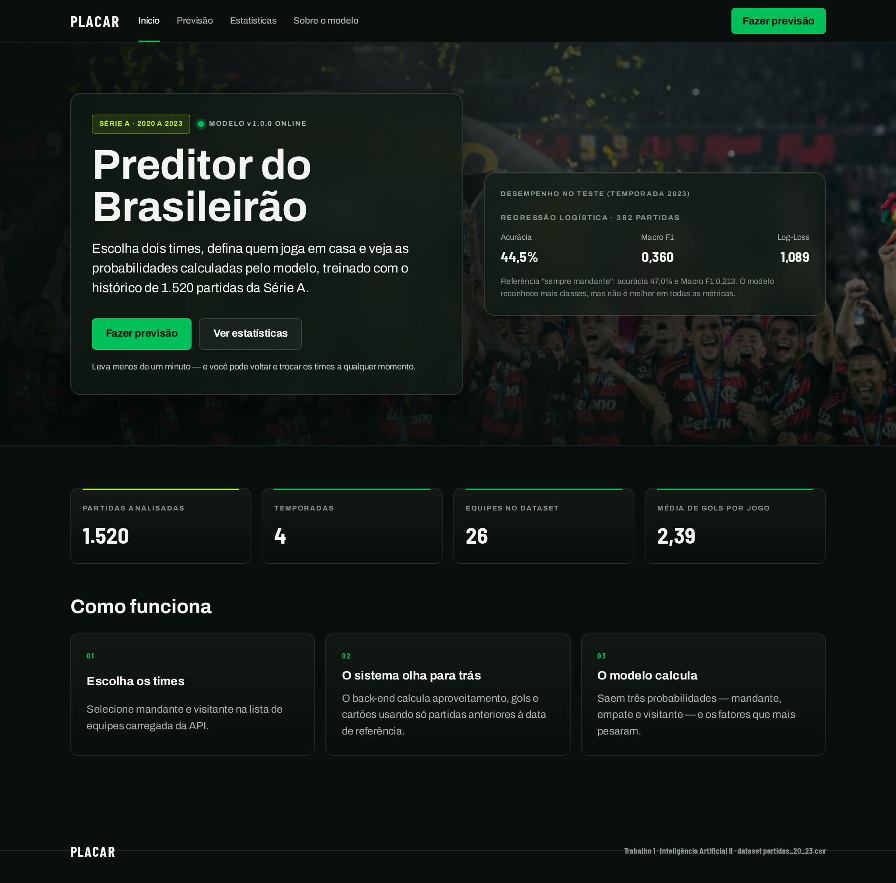
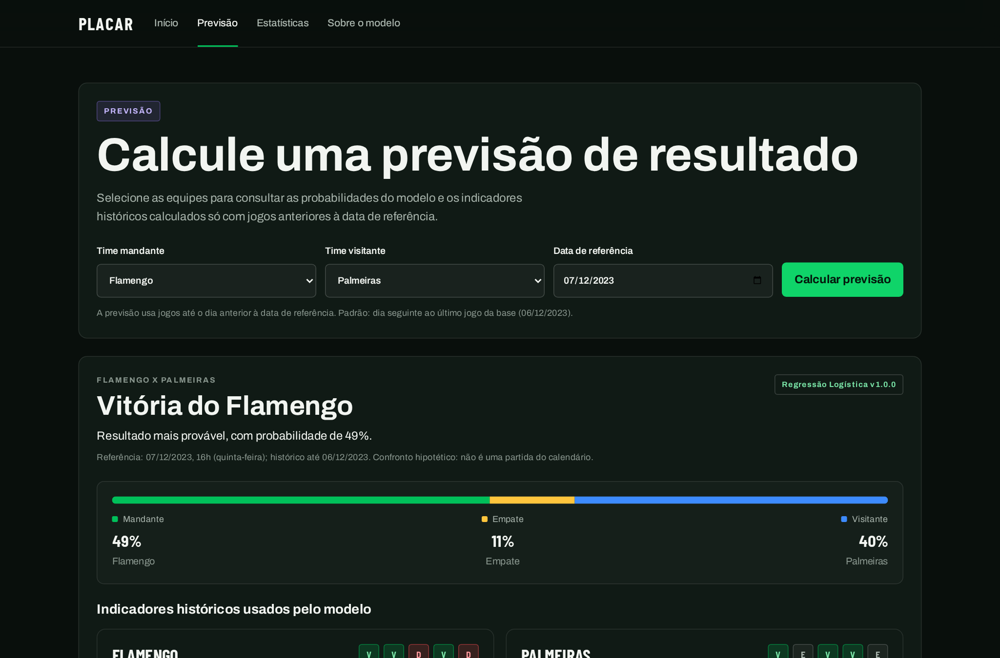

# Previsão de resultados do Brasileirão Série A

Trabalho 1 de Inteligência Artificial II — AMF — 2026/02.

**Integrantes:** Marcelo da Costa Telles, Arthur Zanon e Milton Roberto.

Classificação supervisionada do resultado de partidas (**vitória do mandante, empate ou vitória do visitante**) com atributos calculados somente com informações anteriores ao jogo. O repositório contém a análise exploratória, o treinamento e a avaliação de modelos, uma **API** que serve o modelo salvo e um **front-end** para demonstração.

## Entrega

| Item | Local |
|---|---|
| Relatório técnico (PDF) | [`reports/relatorio_tecnico.pdf`](reports/relatorio_tecnico.pdf) (fonte gerada em [`.md`](reports/relatorio_tecnico.md)) |
| Capturas da aplicação funcionando | [`reports/screenshots/`](reports/screenshots) |
| Capturas do JupyterLab | [`reports/evidencias/`](reports/evidencias) |
| Notebooks executados | [`notebooks/`](notebooks) (`01` EDA, `02` modelagem, `03` demonstração) |
| Modelo salvo e metadados | [`models/model.joblib`](models/model.joblib), [`models/metadata.json`](models/metadata.json) |
| Métricas reais da última execução | [`reports/evidencias/metricas_execucao.json`](reports/evidencias/metricas_execucao.json) |
| Auditoria técnica e status | [`AUDITORIA_FINAL_PROJETO.md`](AUDITORIA_FINAL_PROJETO.md), [`STATUS_ENTREGA.md`](STATUS_ENTREGA.md), [`CHECKLIST_ACOES_MANUAIS.md`](CHECKLIST_ACOES_MANUAIS.md) |

## Problema, dataset e protocolo

- **Dataset:** [`partidas_20_23.csv`](partidas_20_23.csv), 1.520 partidas, 17 colunas, temporadas 2020–2023 (380 por temporada, 26 clubes). Os links dos registros apontam para o domínio Opta Player Stats / Stats Perform (`optaplayerstats.statsperform.com`). **O procedimento original de coleta e a licença específica da base não estão documentados**; use-a apenas para este trabalho acadêmico e confirme as condições de uso com o professor. O arquivo original nunca é alterado (o SHA-256 é gravado nos metadados do modelo).
- **Base processada:** [`data/processed/partidas_processadas.csv`](data/processed/partidas_processadas.csv) (66 colunas; 1.414 partidas com histórico suficiente).
- **Alvo:** `home_win`, `draw`, `away_win` (0, 1, 2), derivado do placar.
- **Sem vazamento:** os atributos usam somente os 5 jogos anteriores de cada equipe (`shift(1)`); placar, gols, cartões e resultado da própria partida nunca são entradas. Testes automatizados verificam isso.
- **Divisão temporal:** treino 2020–2021 (689) · validação 2022 (363) · teste 2023 (362). O modelo é escolhido pelo Macro F1 da validação, reajustado em 2020–2022 (1.052) e avaliado uma única vez no teste. 34 atributos (31 numéricos e 3 categóricos); imputação, escala e codificação são ajustadas só no treino, dentro de um `Pipeline`.

## Resultados (execução de 21/09/2026)

Regressão Logística (L2, C=0,5), semente 42, no teste de 2023:

| | Regressão Logística | Sempre mandante | Frequências históricas |
|---|---|---|---|
| Acurácia | 44,48% | 46,96% | 46,96% |
| Macro F1 | 0,360 | 0,213 | 0,213 |
| Log-Loss | 1,089 | n/a | 1,061 |
| Brier | 0,652 | n/a | 0,640 |

O modelo reconhece mais classes que a referência majoritária (recall: mandante 72,4%, empate 16,0%, visitante 23,5%), mas **tem acurácia menor e Log-Loss/Brier piores que a referência de frequências históricas**; não demonstra superioridade geral. Random Forest e HistGradientBoosting foram comparados na validação (o HistGradientBoosting mostrou forte sobreajuste: 91,0% no treino contra 37,2% na validação). Números completos, matrizes de confusão, calibração e importância por permutação estão no relatório.

## Capturas

| Início | Previsão |
|---|---|
|  |  |

Demais capturas (estatísticas, modelo, celular) em [`reports/screenshots/`](reports/screenshots).

## Requisitos

- Python 3.12 ou superior (testado com 3.14.4) e `venv`
- Node.js 20+ e npm (testado com Node 24)
- Linux/macOS: `make` (opcional). No Windows use os comandos equivalentes abaixo (`.\.venv\Scripts\python.exe`).

## Instalação

```bash
python3 -m venv .venv
source .venv/bin/activate                     # Windows: .venv\Scripts\activate
pip install -r requirements-dev.txt -r reports/requirements_documentacao.txt
cd frontend && npm install && cd ..
```

Com `make`: `make setup`.

## Como executar

| Etapa | Comando | Make |
|---|---|---|
| Processamento dos dados, EDA e figuras 01–13 | `python src/data_analysis.py` | `make data` |
| Treino, avaliação, modelo salvo e figuras 14–20 | `python src/modeling.py` | `make train` |
| Testes Python | `python -m pytest tests` | `make test-py` |
| Testes, tipos e lint do front-end | `cd frontend && npm test && npm run typecheck && npm run lint` | `make test-front` / `make lint` |
| API | `python src/api.py` (http://127.0.0.1:8000/api) | `make api` |
| Front-end | `cd frontend && npm run dev` (http://localhost:5173) | `make front` |
| API + front-end | — | `make run` |
| Capturas reais (com API e front rodando) | `python -m playwright install chromium` e `python scripts/capturar_screenshots.py` | `make screenshots` |
| Relatório em PDF | `python scripts/gerar_relatorio_tecnico.py` | `make report` |
| Notebooks | `python -m jupyter lab` e *Run All Cells* em `notebooks/` | — |

Ordem sugerida para reproduzir tudo: `data` → `train` → `test` → `api` + `front` → `screenshots` → `report`.

Para reexecutar os notebooks pela linha de comando:

```bash
python scripts/preparar_notebook_demonstracao.py   # recria o 03 e atualiza o 02 (sem saídas)
python -m jupyter nbconvert --to notebook --execute --inplace notebooks/0{1,2,3}_*.ipynb
```

### API

Configurada por variáveis de ambiente (ver [`.env.example`](.env.example)): `API_HOST` (padrão `127.0.0.1`), `API_PORT` (`8000`) e `CORS_ORIGINS`. Se o modelo (`models/model.joblib`) não existir, a API sobe em modo degradado e `POST /api/predict` responde 503 (nunca inventa previsões). O front-end procura a API em `http://localhost:8000/api`; para mudar, defina `VITE_API_URL` em `frontend/.env` (veja `frontend/.env.example`).

| Endpoint | Descrição |
|---|---|
| `GET /api/health` | Estado da API, do modelo e da base |
| `GET /api/docs` | Lista de endpoints |
| `GET /api/model` | Metadados, métricas reais e limitações do modelo |
| `GET /api/teams` | Equipes, elegibilidade e limites de data para previsão |
| `GET /api/teams/{team_id}/summary` | Resumo de desempenho de uma equipe |
| `GET /api/teams/compare?team_a=&team_b=` | Comparação e confronto direto |
| `GET /api/stats/overview?season=&team=&venue=` | Indicadores do recorte |
| `GET /api/stats/charts?season=&team=&venue=` | Séries para gráficos |
| `GET /api/matches?season=&team=&venue=&page=&page_size=` | Partidas paginadas (máx. 50 por página) |
| `POST /api/predict` | `{"home_team", "away_team", "date"?, "hour"?}` ou `{"match_id"}` → 3 probabilidades, classe prevista, forma recente, confronto direto e fatores |

Exemplo:

```bash
curl -s -X POST http://127.0.0.1:8000/api/predict -H 'Content-Type: application/json' \
     -d '{"home_team": "flamengo", "away_team": "palmeiras"}'
```

A previsão de confrontos hipotéticos usa os jogos até o dia anterior à data de referência (padrão: dia seguinte ao último jogo da base) e calcula os atributos com o mesmo código do treinamento. Equipes sem 5 jogos ou sem jogos recentes são recusadas com HTTP 422.

## Organização

```text
partidas_20_23.csv         Dataset original (somente leitura)
data/processed/            Base processada
src/                       EDA/preparação, partições, modelagem, avaliação, API, previsão e estatísticas
models/                    Modelo salvo e metadados
tests/                     Testes Python (dados, vazamento, modelo, previsão, API)
frontend/                  Interface React + TypeScript + Vite (com testes Vitest)
notebooks/                 EDA, modelagem e demonstração (executados)
scripts/                   Relatório PDF, capturas de tela e preparação de notebooks
reports/                   Relatório, figuras, evidências e capturas
```

## Tecnologias

Python (pandas, NumPy, scikit-learn, matplotlib, seaborn, joblib, ReportLab) · API com `http.server` da biblioteca padrão · React 19, TypeScript, Vite, Recharts · pytest, ruff, Vitest, Testing Library, Oxlint · Playwright (capturas).

## Limitações

- Quatro temporadas de uma única competição; sem escalações, lesões ou informações externas.
- Sem busca sistemática de hiperparâmetros, calibração, intervalos de confiança ou avaliação em várias janelas temporais.
- Importâncias e coeficientes são associações, não causalidade.
- Coleta original e licença do dataset não documentadas; aprovação do dataset, envio no Classroom e registro das contribuições individuais dependem da equipe (veja [`CHECKLIST_ACOES_MANUAIS.md`](CHECKLIST_ACOES_MANUAIS.md)).
