# Análise exploratória e preparação dos dados — Brasileirão Série A (2020–2023)

Disciplina de Inteligência Artificial II. Este documento resume a etapa de análise exploratória (EDA) e de preparação dos dados que antecede o treinamento de um modelo de classificação do resultado das partidas. Todos os números abaixo foram calculados pelo código em `src/data_analysis.py` (executado pelo notebook `notebooks/01_eda_preparacao.ipynb` ou diretamente pela linha de comando) e correspondem exatamente aos valores encontrados na base.

## 1. Descrição do dataset

O arquivo `partidas_20_23.csv` reúne 1.520 partidas do Campeonato Brasileiro Série A das temporadas de 2020 a 2023, com 380 partidas por temporada, disputadas por 26 equipes diferentes. Cada linha representa uma partida e traz o placar, a data, o estádio, o público, o árbitro e listas de eventos (gols, cartões amarelos, vermelhos e segundos amarelos) de cada equipe.

**Objetivo futuro:** prever a classe do resultado — vitória do mandante, empate ou vitória do visitante — antes da partida acontecer.

## 2. Origem e período dos dados

Os links de cada partida apontam para o portal `optaplayerstats.statsperform.com` (dados Stats Perform/Opta), o que indica a fonte da coleta; o arquivo não traz documentação sobre o método de coleta, portanto essa origem é inferida dos links. A primeira partida ocorreu em 08/08/2020 e a última em 06/12/2023. A temporada 2020 teve 112 partidas disputadas em 2021, por isso a temporada foi extraída do link e não do ano da data.

## 3. Dimensões da base

- Base original: **1.520 linhas × 17 colunas** (memória aproximada de 2,30 MB).
- Base processada: **1.520 linhas × 66 colunas** (`data/processed/partidas_processadas.csv`).
- Partidas por temporada: 2020: 380, 2021: 380, 2022: 380, 2023: 380.

## 4. Descrição das principais colunas

| Coluna original | Descrição |
|---|---|
| home_team / away_team | Nome do mandante e do visitante. |
| home_team_score / away_team_score | Gols do mandante e do visitante no placar final. |
| game_date | Data e hora da partida, em texto no formato "25 de fevereiro de 2021 21:30". |
| stadium | Estádio onde a partida foi disputada. |
| public | Público, em texto ("12.089") ou o marcador "No data". |
| ref | Nome do árbitro. |
| yellow_cards_home / yellow_cards_away | Lista JSON de cartões amarelos (jogador e minuto). |
| red_cards_home / red_cards_away | Lista JSON de cartões vermelhos diretos (jogador e minuto). |
| sec_card_home / sec_card_away | Lista JSON de expulsões por segundo cartão amarelo (jogador e minuto). |
| gols_home / gols_away | Lista JSON de gols (jogador, minuto, indicador de gol contra `cont` e de pênalti `penal`). |
| link | Endereço da página da partida; contém o identificador da competição/temporada. |

## 5. Qualidade dos dados

Cada verificação abaixo foi executada sobre os dados; "Quantidade" é o número de ocorrências encontradas.

| Verificação | Quantidade | Tratamento adotado |
|---|---|---|
| Linhas completamente duplicadas | 0 | Nenhum tratamento necessário. |
| Links duplicados | 0 | Nenhum tratamento necessário; o link identifica a partida. |
| Combinações duplicadas (data, mandante, visitante) | 0 | Nenhum tratamento necessário. |
| Mandante igual ao visitante | 0 | Nenhum tratamento necessário. |
| Placares negativos | 0 | Nenhum tratamento necessário. |
| Placares não numéricos | 0 | Nenhum tratamento necessário. |
| Gols do placar ≠ eventos de gol (mandante ou visitante) | 0 | O placar é mantido como fonte principal; divergências seriam apenas documentadas. |
| Listas JSON inválidas ou de tipo inesperado | 0 | Conversão segura sem eval; conteúdo inválido viraria lista vazia e seria registrado. |
| Temporadas com quantidade de partidas ≠ 380 | 0 | Nenhum tratamento necessário. |
| Temporadas com quantidade de equipes ≠ 20 | 0 | Nenhum tratamento necessário. |
| Nomes de equipe com espaços extras | 0 | Aplicado strip e colapso de espaços (sem efeito neste arquivo). |
| Variações do mesmo time (sem acento, caixa ou pontuação) | 0 | Nenhum tratamento necessário; um nome por equipe. |
| Pares de nomes muito parecidos (similaridade ≥ 0,85) | 0 | Revisão manual: nenhum par indica a mesma equipe. |
| Equipes que não disputaram as quatro temporadas | 15 | Mantidas; o histórico usa apenas os jogos disponíveis de cada equipe. |
| Mesma equipe em duas partidas no mesmo instante | 0 | Nenhum tratamento necessário. |
| Estádio ausente (vazio ou No data) | 0 | Nenhum tratamento necessário. |
| Árbitro ausente (vazio ou No data) | 0 | Nenhum tratamento necessário. |
| Público ausente (No data) | 613 | Mantido como valor ausente (NaN); nunca substituído por zero. |
| Público em formato inesperado | 0 | Nenhum tratamento necessário. |
| Datas não interpretadas | 0 | Nenhum tratamento necessário. |
| Temporada não extraída do link | 0 | Nenhum tratamento necessário. |
| Partidas disputadas em ano calendário diferente da temporada | 112 | Mantidas; a temporada vem do link e não do ano da data. |

Além dos nulos do Pandas, foram procuradas ausências "disfarçadas" (texto vazio, `No data` e listas vazias):

| coluna | texto_vazio | no_data | lista_vazia | total_sem_informacao |
|---|---|---|---|---|
| public | 0 | 613 | 0 | 613 |
| stadium | 0 | 0 | 0 | 0 |
| ref | 0 | 0 | 0 | 0 |
| yellow_cards_home | 0 | 0 | 113 | 113 |
| red_cards_home | 0 | 0 | 1.392 | 1.392 |
| gols_home | 0 | 0 | 367 | 367 |
| yellow_cards_away | 0 | 0 | 120 | 120 |
| red_cards_away | 0 | 0 | 1.377 | 1.377 |
| gols_away | 0 | 0 | 543 | 543 |
| sec_card_home | 0 | 0 | 1.457 | 1.457 |
| sec_card_away | 0 | 0 | 1.439 | 1.439 |

Listas vazias em cartões e gols são, em geral, ausência legítima de eventos (por exemplo, equipe que não marcou gols). Já 20 partidas não têm nenhum cartão amarelo registrado; isso é possível, mas não foi possível confirmar se houve falha de coleta, e os valores foram mantidos.

## 6. Valores ausentes

Na leitura padrão do Pandas nenhuma coluna possui valores nulos, porque a ausência está codificada como texto. A única coluna com informação faltante é `public`, com **613 partidas com `No data` (40,3%)**. O valor foi convertido para ausente (NaN) e nunca para zero, pois `No data` não significa público igual a zero.

| Temporada | Partidas | Sem público | % sem público |
|---|---|---|---|
| 2020 | 380 | 380 | 100,00 |
| 2021 | 380 | 218 | 57,37 |
| 2022 | 380 | 2 | 0,53 |
| 2023 | 380 | 13 | 3,42 |

**Padrão temporal.** Em 2020, 380 de 380 partidas estão sem público. Em 2021, a ausência ocorre em bloco: a primeira partida com público informado foi em 18/09/2021; das 193 partidas anteriores a essa data, 0 têm público, e a partir dela 162 de 187 têm. Em 2022 e 2023 a ausência é residual (2 e 13 partidas, respectivamente) — veja `figures/12_publico_ausente_por_mes.png`.

**Possível impacto da pandemia.** Os dados mostram que a ausência do público concentra-se exatamente no início do período (2020 e parte de 2021) e desaparece quase por completo depois. Esse padrão é compatível com partidas sem torcida, mas os dados, por si só, não permitem distinguir "jogo com portões fechados" de "público não coletado", pois a fonte usa o mesmo marcador (`No data`) nos dois casos. Por isso essa explicação é tratada como hipótese a ser confirmada com fonte externa, e não como fato. Um indício adicional é que os primeiros públicos informados em 2021 são baixos (mínimo de 115 pessoas), o que também é compatível com reabertura gradual dos estádios, sem prová-la. Consequência prática: a variável `publico` não pode ser usada como entrada do modelo sem tratamento específico, pois sua ausência está fortemente associada ao período e, por consequência, à temporada.

## 7. Duplicidades

Não foram encontradas linhas duplicadas (0), links duplicados (0) nem combinações repetidas de data, mandante e visitante (0). Nenhuma equipe aparece em duas partidas no mesmo instante.

## 8. Inconsistências encontradas

- **Gols × eventos:** não houve nenhuma divergência entre o placar e o número de eventos de gol (3.637 eventos contra 3.637 gols no placar). Foram registrados 88 gols contra, todos incluídos na lista da equipe que recebeu o gol, o que é coerente com o placar. Ainda assim, o placar registrado permanece como fonte principal do resultado e as listas não são usadas para corrigi-lo.
- **Segundo amarelo:** dos 149 segundos amarelos, 149 têm o jogador também na lista de amarelos (o primeiro cartão) e 10 aparecem com o mesmo jogador e minuto na lista de amarelos, o que sugere que nesses casos o segundo amarelo também foi contado como amarelo. Como a duplicação é rara e não pode ser confirmada, `total_amarelos` foi mantido como a soma das listas, sem correção.
- **Eventos:** entre 11.558 eventos verificados, nenhum tem minuto fora do formato, jogador vazio ou duplicidade dentro da mesma lista.
- **Público suspeito:** a partida de menor público é Avai FC × Fluminense FC (16/10/2022), com 79 pessoas. Nas outras 18 partidas com público informado nesse estádio, o mínimo é 2.025 e a mediana 9.146; o valor pode ser um erro de coleta, mas não há como confirmá-lo com os dados. Foi mantido e sinalizado.
- **Nomes de equipes:** sem espaços extras, sem variações do mesmo time e sem pares de nomes parecidos (0). Os nomes são os oficiais completos (por exemplo, `Santos FC Sao Paulo`, `SC do Recife`); nos gráficos foram usados nomes curtos apenas para legibilidade.

## 9. Transformações realizadas

- Leitura do CSV como texto, para preservar marcadores como `No data`; o arquivo original não é alterado.
- Conversão de `game_date` para `datetime` com dicionário de meses em português (sem depender do idioma do sistema) e ordenação cronológica.
- Extração da temporada do `link` por expressão regular (`série-a-AAAA`), com verificação de que todas as linhas ficaram entre 2020 e 2023.
- Conversão de `public` para número (`12.089` → 12089) mantendo `No data` como ausente.
- Conversão segura das oito colunas JSON com `json.loads` (sem `eval`); conteúdo inválido viraria lista vazia e seria registrado.
- Criação da variável-alvo a partir do placar registrado.
- Criação de variáveis derivadas da partida e de médias históricas dos últimos cinco jogos (com `shift(1)`).

## 10. Variáveis criadas

| Coluna(s) | Descrição |
|---|---|
| id_partida | Identificador sequencial da partida após a ordenação cronológica. |
| id_partida_fonte | Identificador da partida extraído do link (rastreabilidade). |
| temporada | Temporada extraída do link (2020 a 2023). |
| data_partida | Data e hora convertidas para `datetime`. |
| ano_calendario, mes, dia_semana, hora | Componentes da data (hora inteira, 0–23). |
| publico | Público numérico; ausente quando o original é `No data`. |
| resultado, resultado_codigo | Variável-alvo: home_win=0, draw=1, away_win=2. |
| gols_eventos_*, amarelos_*, vermelhos_diretos_*, segundos_amarelos_*, expulsoes_* | Quantidades extraídas das listas JSON para mandante e visitante. |
| penaltis_convertidos_*, gols_contra_* | Gols de pênalti e gols contra registrados na lista de gols de cada lado. |
| total_gols, saldo_gols_mandante, total_amarelos, total_expulsoes | Derivadas da própria partida (uso descritivo). |
| teve_expulsao, teve_penalti_convertido, teve_gol_contra | Indicadores 0/1 da própria partida. |
| *_ultimos_5_mandante / *_ultimos_5_visitante | Médias e contagens dos cinco jogos anteriores de cada equipe. |
| aproveitamento_mandante_em_casa, aproveitamento_visitante_fora | Aproveitamento nos últimos jogos no mesmo mando (3 a 5 jogos). |
| jogos_anteriores_mandante / jogos_anteriores_visitante | Quantidade de jogos anteriores da equipe na base. |
| utilizavel_ml | 1 quando as duas equipes têm ao menos cinco jogos anteriores. |

**Significado das classes da variável-alvo** (definidas pelo placar registrado):

| Classe | Significado | Código | Partidas | % |
|---|---|---|---|---|
| home_win | Vitória do mandante | 0 | 691 | 45,5 |
| draw | Empate | 1 | 427 | 28,1 |
| away_win | Vitória do visitante | 2 | 402 | 26,4 |

## 11. Principais resultados da análise exploratória

### Distribuição geral

- Classes: vitória do mandante 45,5%, empate 28,1% e vitória do visitante 26,4%. A classe majoritária representa 45,5% das partidas, valor de referência para qualquer modelo (um classificador que sempre prevê vitória do mandante acertaria essa proporção).
- Gols por partida: média 2,39, mediana 2, mínimo 0 e máximo 10. Média de 1,38 gols dos mandantes e 1,02 dos visitantes.
- 43,5% das partidas têm ao menos três gols; 23,1% têm ao menos uma expulsão; média de 4,92 amarelos e 0,294 expulsões por partida.
- 22,9% das partidas tiveram pênalti convertido e 5,7% tiveram gol contra.

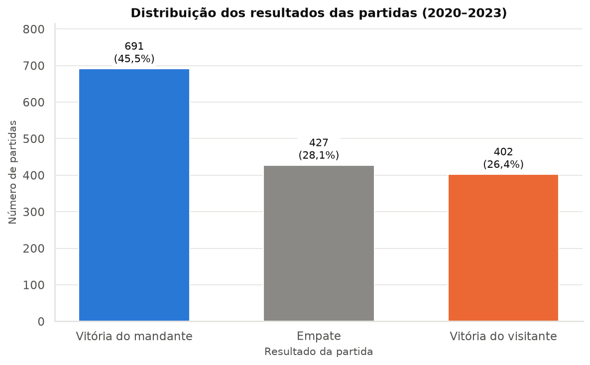

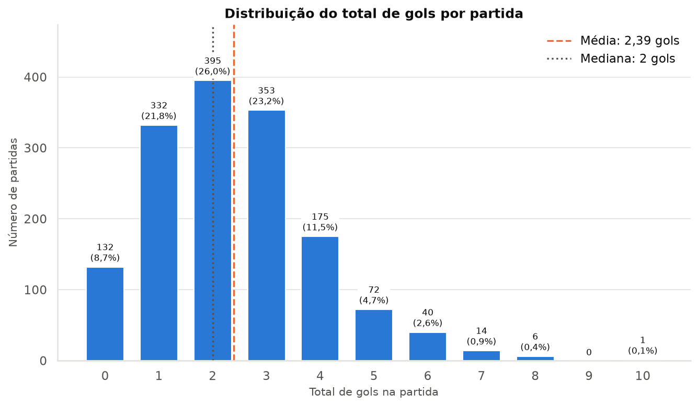

### Por temporada

| Temporada | Partidas | Gols/partida | Gols mandante | Gols visitante | Amarelos/partida | Expulsões/partida | % com expulsão |
|---|---|---|---|---|---|---|---|
| 2020 | 380 | 2,48 | 1,41 | 1,07 | 4,44 | 0,29 | 22,89 |
| 2021 | 380 | 2,22 | 1,27 | 0,94 | 4,66 | 0,25 | 19,21 |
| 2022 | 380 | 2,38 | 1,41 | 0,98 | 5,11 | 0,32 | 25,26 |
| 2023 | 380 | 2,49 | 1,42 | 1,07 | 5,47 | 0,32 | 25,00 |

| Temporada | % home_win | % draw | % away_win |
|---|---|---|---|
| 2020 | 45,0 | 28,4 | 26,6 |
| 2021 | 45,8 | 29,7 | 24,5 |
| 2022 | 44,2 | 28,4 | 27,4 |
| 2023 | 46,8 | 25,8 | 27,4 |

- A média de gols varia de 2,22 (2021) a 2,49 (2023); o teste de Kruskal-Wallis não indica diferença estatisticamente significativa entre as temporadas ao nível de 5% (p = 0,074).
- Os cartões amarelos por partida passam de 4,44 em 2020 para 5,47 em 2023, com diferença significativa entre as temporadas (Kruskal-Wallis, p < 0,001). Os dados não explicam a causa dessa mudança (por exemplo, critério de arbitragem ou coleta), então ela é registrada apenas como um fato observado.
- A distribuição dos resultados não difere significativamente entre as temporadas (qui-quadrado = 2,24, p = 0,897).
- Público (apenas partidas com informação): mediana de 9.464 em 2021 (162 partidas), 18.055 em 2022 (378) e 27.604 em 2023 (367); 2020 não tem nenhuma partida com público. Como 2021 contém sobretudo partidas de fim de temporada, as médias por temporada não são comparáveis entre si sem cuidado.

| Temporada | Com público | Média | Mediana | Mínimo | Máximo |
|---|---|---|---|---|---|
| 2020 | 0 | — | — | — | — |
| 2021 | 162 | 15.207 | 9.464 | 115 | 61.573 |
| 2022 | 378 | 21.505 | 18.055 | 79 | 69.997 |
| 2023 | 367 | 27.755 | 27.604 | 1.943 | 69.473 |

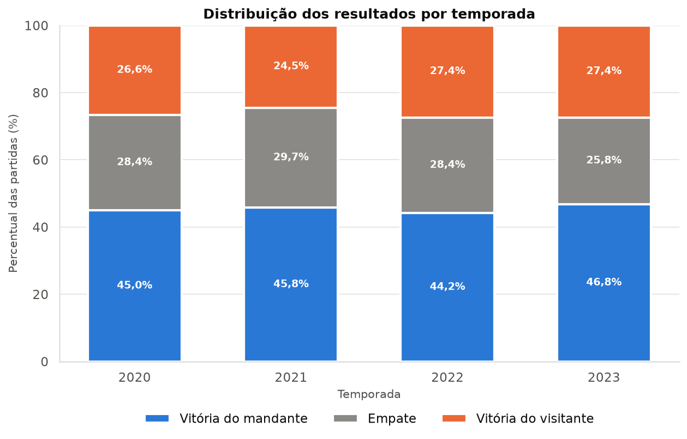

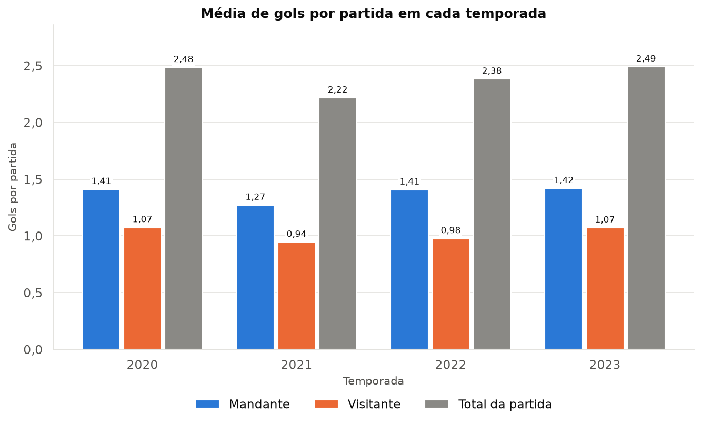

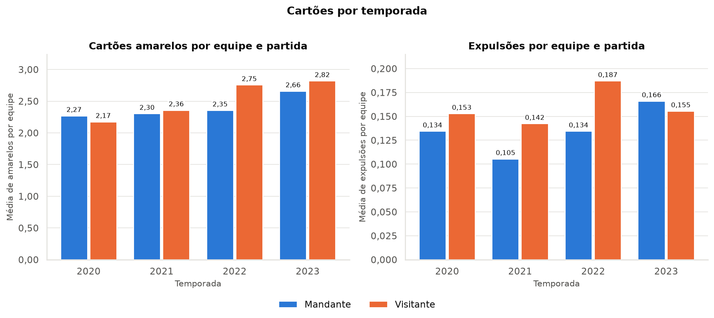

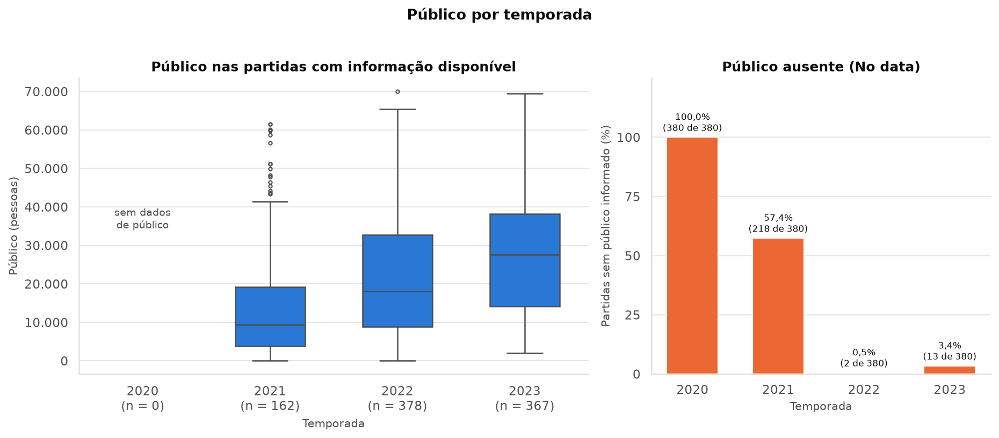

### Por equipe

Foram analisadas 26 equipes; 11 disputaram as quatro temporadas. Como as equipes disputaram quantidades diferentes de jogos, rankings baseados em totais favorecem quem esteve em mais temporadas; por isso as tabelas trazem o número de partidas, e os rankings de médias exigem no mínimo 38 partidas (uma temporada completa).

**Mais vitórias**

| Equipe | Partidas | Vitórias | Aproveitamento (%) |
|---|---|---|---|
| Clube Atlético Mineiro | 152 | 80 | 60,53 |
| CR Flamengo | 152 | 79 | 59,21 |
| SE Palmeiras | 152 | 78 | 60,31 |
| Fluminense FC | 152 | 70 | 53,51 |
| SC Internacional | 152 | 67 | 53,95 |

**Melhores aproveitamentos (mín. 38 jogos)**

| Equipe | Partidas | Pontos | Aproveitamento (%) |
|---|---|---|---|
| Clube Atlético Mineiro | 152 | 276 | 60,53 |
| SE Palmeiras | 152 | 275 | 60,31 |
| CR Flamengo | 152 | 270 | 59,21 |
| SC Internacional | 152 | 246 | 53,95 |
| Fluminense FC | 152 | 244 | 53,51 |

**Maiores médias de gols marcados (mín. 38 jogos)**

| Equipe | Partidas | Gols marcados | Gols marcados por jogo |
|---|---|---|---|
| CR Flamengo | 152 | 253 | 1,66 |
| SE Palmeiras | 152 | 239 | 1,57 |
| Clube Atlético Mineiro | 152 | 228 | 1,50 |
| Grêmio FB Porto Alegrense | 114 | 160 | 1,40 |
| SC Internacional | 152 | 209 | 1,38 |

**Melhores saldos de gols**

| Equipe | Partidas | Gols marcados | Gols sofridos | Saldo de gols |
|---|---|---|---|---|
| SE Palmeiras | 152 | 239 | 140 | 99 |
| CR Flamengo | 152 | 253 | 165 | 88 |
| Clube Atlético Mineiro | 152 | 228 | 148 | 80 |
| SC Internacional | 152 | 209 | 153 | 56 |
| Fluminense FC | 152 | 207 | 168 | 39 |

**Mais cartões amarelos**

| Equipe | Partidas | Amarelos | Amarelos por jogo |
|---|---|---|---|
| SC Internacional | 152 | 404 | 2,66 |
| São Paulo FC | 152 | 399 | 2,62 |
| Santos FC Sao Paulo | 152 | 390 | 2,57 |
| Fluminense FC | 152 | 383 | 2,52 |
| Red Bull Bragantino | 152 | 372 | 2,45 |

**Mais expulsões**

| Equipe | Partidas | Expulsões | Expulsões por jogo |
|---|---|---|---|
| SC Internacional | 152 | 30 | 0,197 |
| Fluminense FC | 152 | 27 | 0,178 |
| Coritiba FBC | 114 | 26 | 0,228 |
| SE Palmeiras | 152 | 25 | 0,164 |
| Ceará SC | 114 | 22 | 0,193 |

Entre as equipes elegíveis, o maior aproveitamento é do Atlético-MG (60,5%), e 24 das 26 equipes tiveram aproveitamento maior como mandante do que como visitante. Os totais (vitórias, cartões) favorecem as equipes que disputaram mais temporadas; por isso as colunas de média ou de partidas devem ser lidas junto.

A tabela completa por equipe (incluindo desempenho como mandante e visitante) está no notebook. O aproveitamento dos mandantes foi de 54,8% e o dos visitantes de 35,8%.

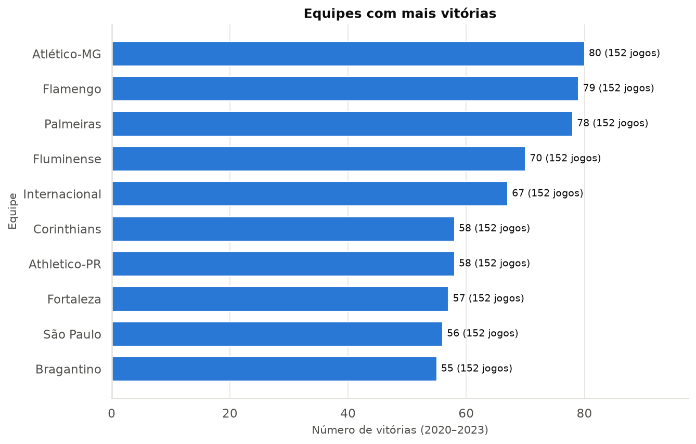

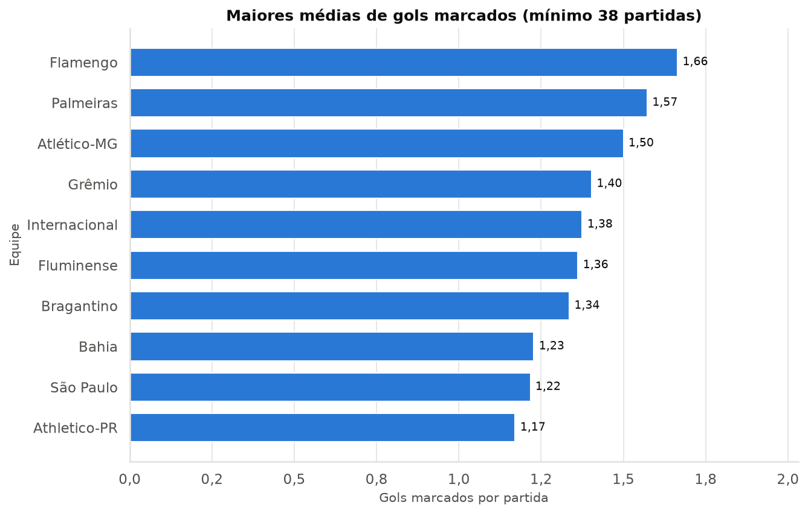

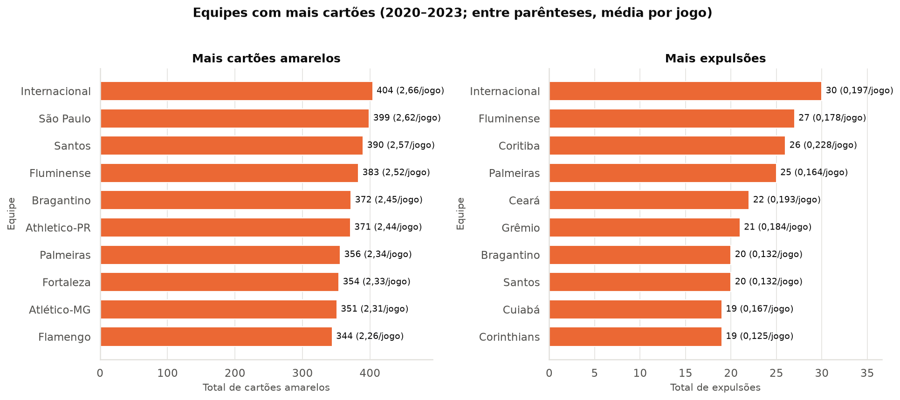

### Relações entre variáveis

As relações abaixo são descritivas. Correlação ou associação não implica causalidade.

- **Mando de campo:** 691 vitórias de mandantes contra 402 de visitantes (teste binomial entre partidas com vencedor, p < 0,001). Mandantes marcam em média 1,38 gols contra 1,02 dos visitantes.
- **Gols e resultado:** o resultado é definido pelo próprio placar, então a relação é uma consequência direta e não uma descoberta; ela serve apenas para descrever as classes.

| Resultado | Gols mandante | Gols visitante | Total de gols |
|---|---|---|---|
| home_win | 2,15 | 0,49 | 2,64 |
| draw | 0,92 | 0,92 | 1,83 |
| away_win | 0,53 | 2,03 | 2,56 |

- **Cartões amarelos e resultado:** as médias por classe ficam próximas; o total de amarelos é um pouco menor nas vitórias do mandante.

| Resultado | Amarelos mandante | Amarelos visitante | Total |
|---|---|---|---|
| home_win | 2,33 | 2,43 | 4,76 |
| draw | 2,42 | 2,56 | 4,98 |
| away_win | 2,47 | 2,65 | 5,12 |

- **Expulsões e resultado:** quando só o mandante teve jogador expulso, o mandante venceu em 24,1% das 137 partidas; quando só o visitante teve expulsão, o mandante venceu em 63,2% das 171; sem expulsões, 46,0% das 1169. A base não informa em que momento o placar estava quando ocorreu cada expulsão; portanto não é possível separar o efeito da expulsão da situação de jogo que a antecedeu.

| situação | partidas | home_win (%) | draw (%) | away_win (%) |
|---|---|---|---|---|
| Sem expulsão na partida | 1.169 | 46,0 | 28,2 | 25,7 |
| Expulsão apenas do mandante | 137 | 24,1 | 28,5 | 47,4 |
| Expulsão apenas do visitante | 171 | 63,2 | 23,4 | 13,5 |
| Expulsão dos dois times | 43 | 27,9 | 41,9 | 30,2 |

- **Público e gols:** correlação de Spearman de 0,035 (n = 907, p = 0,286); não há evidência de relação linear/monotônica relevante.
- **Público e resultado:** a mediana do público é 21.670 nas vitórias do mandante, 18.686 nos empates e 17.628 nas vitórias do visitante (Kruskal-Wallis p = 0,025). Como o público depende do mandante (equipes com maior torcida têm mais público e também vencem mais em casa) e da temporada, essa associação não deve ser interpretada como causal.

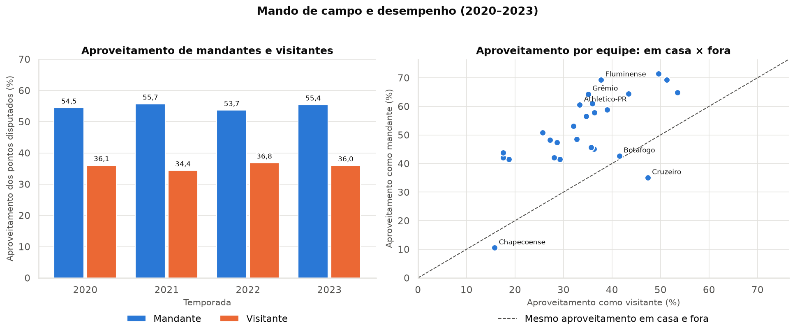

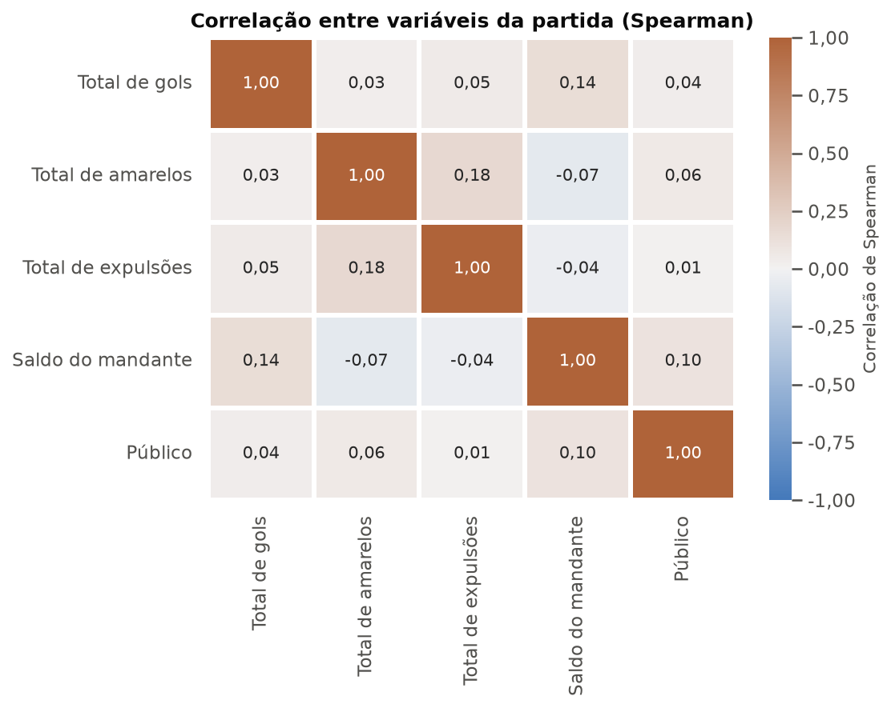

### Valores extremos (outliers)

Os valores extremos foram examinados pelo intervalo interquartil (IQR) e por inspeção das linhas. **Nenhum valor foi removido.**

| variável | Q1 | Q3 | limite inferior | limite superior | abaixo | acima | mínimo | máximo |
|---|---|---|---|---|---|---|---|---|
| Gols na partida | 1,0 | 3,0 | -2,0 | 6,0 | 0 | 21 | 0,0 | 10,0 |
| Amarelos na partida | 3,0 | 6,0 | -1,5 | 10,5 | 0 | 23 | 0,0 | 15,0 |
| Expulsões na partida | 0,0 | 0,0 | 0,0 | 0,0 | 0 | 351 | 0,0 | 5,0 |
| Público | 9.157,0 | 35.815,5 | -30.830,8 | 75.803,2 | 0 | 0 | 79,0 | 69.997,0 |

- **Placares altos:** o maior total é 10 gols (Goiás EC 4 × 6 EC Bahia, 07/10/2023). Nos placares mais altos o número de eventos de gol coincide com o placar, o que sustenta que são jogos reais e não erros de coleta.
- **Cartões:** o máximo é 15 amarelos em uma partida (SE Palmeiras × Ceará SC, 09/04/2022).
- **Expulsões:** como Q1 = Q3 = 0, o critério do IQR marca qualquer partida com expulsão como outlier, o que não é informativo para uma variável de contagem com muitos zeros; foi usada a inspeção direta. O máximo é 5 expulsões em uma partida (SC Internacional × Botafogo FR, 19/06/2022), com eventos registrados nas listas.
- **Público:** nenhum valor fora dos limites do IQR; o menor (79) foi sinalizado como possível erro de coleta.
- **Decisão:** valores extremos consistentes com as listas de eventos são tratados como eventos reais e mantidos; a checagem externa não foi feita.

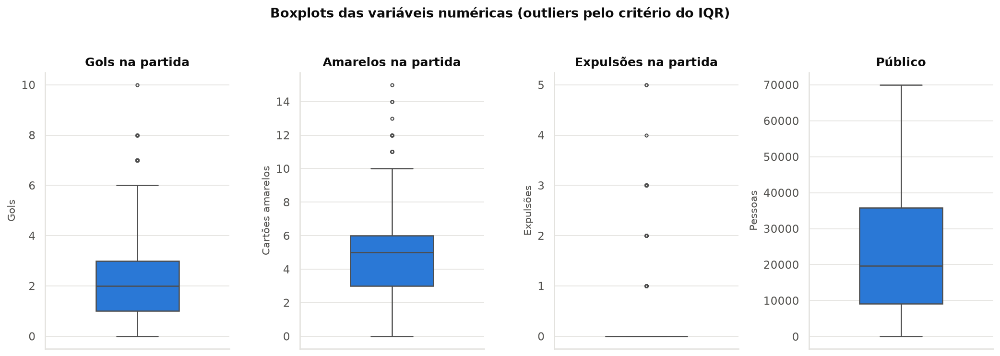

## 12. Gráficos mais relevantes

Os dez gráficos obrigatórios foram gerados em `reports/figures/` (150 DPI), além de três complementares (`11_boxplots_outliers.png`, `12_publico_ausente_por_mes.png`, `13_correlacao_variaveis.png`). Os mais relevantes para o relatório são: `01_distribuicao_resultados.png` (classes e linha de base), `02_resultados_por_temporada.png` (estabilidade entre temporadas), `09_mando_campo_resultado.png` (vantagem do mandante) e `10_publico_por_temporada.png` / `12_publico_ausente_por_mes.png` (qualidade da variável de público).

## 13. Preparação para Machine Learning

**Base utilizável:** 1.414 das 1.520 partidas têm histórico de ao menos 5 jogos anteriores para as duas equipes; 106 foram marcadas como não utilizáveis (`utilizavel_ml = 0`) e permanecem no arquivo para rastreabilidade.

| Temporada | Utilizáveis | Total | Sem histórico suficiente |
|---|---|---|---|
| 2020 | 327 | 380 | 53 |
| 2021 | 362 | 380 | 18 |
| 2022 | 363 | 380 | 17 |
| 2023 | 362 | 380 | 18 |

**Distribuição da variável-alvo:**

| Classe | Base completa | Base utilizável | % completa | % utilizável |
|---|---|---|---|---|
| home_win | 691 | 645 | 45,5 | 45,6 |
| draw | 427 | 395 | 28,1 | 27,9 |
| away_win | 402 | 374 | 26,4 | 26,4 |

**Variáveis históricas.** Para cada partida foram calculadas, separadamente para mandante e visitante, as métricas dos cinco jogos anteriores da equipe (pontos médios, vitórias, empates, derrotas, gols marcados e sofridos, saldo, amarelos, expulsões e aproveitamento), além do aproveitamento do mandante em casa e do visitante fora. As regras adotadas foram:

- As partidas são ordenadas cronologicamente e cada equipe é seguida em ordem de data, independentemente de jogar como mandante ou visitante.
- Usa-se `shift(1)` antes da média móvel; a partida atual nunca entra no próprio histórico.
- **Equipes com menos de 5 jogos anteriores:** o histórico fica ausente (NaN). Não há preenchimento com zero, com a média geral ou com informação futura. A partida é marcada com `utilizavel_ml = 0` e deve ser excluída do treino ou tratada com imputação ajustada somente nos dados de treino.
- O histórico atravessa temporadas consecutivas (o primeiro jogo de 2021 usa os últimos jogos de 2020), mas **é reiniciado quando a equipe ficou ao menos uma temporada inteira fora da base**: 6 equipes têm essa lacuna (por exemplo, Vasco, que disputou apenas 2020 e 2023), e usar jogos de anos antes como "últimos 5 jogos" descreveria mal a equipe atual. Essa escolha mantém 1.414 partidas utilizáveis; reiniciando o histórico a cada temporada seriam 1.312. O custo restante é que o elenco muda entre temporadas consecutivas.
- O aproveitamento em casa/fora usa os últimos 5 jogos no mesmo mando, com no mínimo 3 jogos; abaixo disso fica ausente.

**Testes contra vazamento temporal** (executados automaticamente):

| teste | aprovado | detalhe |
|---|---|---|
| Recalculo independente por força bruta | sim | 33440 valores comparados; 0 divergências |
| Perturbação do futuro não altera o passado | sim | 761 partidas até 09/04/2022, incluindo a própria do corte; 0 valores alterados |
| Placar da própria partida não altera seu histórico | sim | partida id 1512 testada com placar 9x0 |
| Histórico ausente com menos de 5 jogos anteriores e presente a partir de 5 | sim | contagem de jogos anteriores coerente com a presença das médias |
| Primeira partida de cada equipe começa sem histórico | sim | 26 equipes verificadas |

## 14. Riscos de vazamento de dados

Informações que só existem depois da partida não podem ser entradas do modelo para prever essa mesma partida. As colunas abaixo são **proibidas como variáveis de entrada**:

`home_team_score`, `away_team_score`, `gols_home`, `gols_away`, `yellow_cards_home`, `yellow_cards_away`, `red_cards_home`, `red_cards_away`, `sec_card_home`, `sec_card_away`, `total_gols`, `total_amarelos`, `total_expulsoes`, `resultado`, `resultado_codigo`

Pelo mesmo motivo, as colunas derivadas criadas nesta etapa a partir dos eventos da própria partida também são proibidas: `gols_eventos_mandante`, `gols_eventos_visitante`, `amarelos_mandante`, `amarelos_visitante`, `vermelhos_diretos_mandante`, `vermelhos_diretos_visitante`, `segundos_amarelos_mandante`, `segundos_amarelos_visitante`, `expulsoes_mandante`, `expulsoes_visitante`, `penaltis_convertidos_mandante`, `penaltis_convertidos_visitante`, `gols_contra_mandante`, `gols_contra_visitante`, `saldo_gols_mandante`, `teve_expulsao`, `teve_penalti_convertido`, `teve_gol_contra`, `publico`, `public`. O `publico` entra na lista porque só é conhecido no dia do jogo e tem forte ausência no início do período.

Essas colunas podem ser usadas apenas para construir o histórico das equipes, considerando somente partidas anteriores à que está sendo prevista. Colunas conhecidas antes do jogo e candidatas a entrada: equipes, `temporada`, `mes`, `dia_semana`, `hora`, estádio, árbitro e as 22 colunas históricas. Ao dividir os dados em treino e teste, a divisão deve ser cronológica (não aleatória), para que o teste represente o uso real do modelo.

## 15. Limitações do dataset

- **Temporada × ano:** 112 partidas (7,4%) foram disputadas em ano diferente da temporada (todas da temporada 2020, disputadas em 2021); a temporada precisa vir do link.
- **Público:** 40,3% das partidas não têm público e a ausência depende do período (seção 6); não foi imputado.
- **Pandemia:** 2020 e parte de 2021 foram disputados em período de restrições; o comportamento das equipes, do público e das partidas pode não ser comparável ao de 2022–2023. Isso é uma hipótese de contexto, não algo medido por esta base.
- **Gols × eventos:** nenhuma divergência foi encontrada; a qualidade das listas de cartões não pôde ser verificada contra uma fonte externa.
- **Nomenclatura:** os nomes estão padronizados neste arquivo, mas são nomes oficiais longos; uma eventual integração com outra fonte exigirá um dicionário de equivalência.
- **Informações ausentes:** a base não traz escalação, lesões e suspensões, posição na tabela antes do jogo, condição climática, viagem/descanso entre jogos ou odds; a posição na tabela e o descanso podem ser derivados do histórico em etapas futuras.
- **Poucas temporadas:** apenas 4 temporadas; 11 das 26 equipes disputaram todas. Equipes com uma única temporada têm pouco histórico e estatísticas menos estáveis.
- **Mudança entre temporadas:** o aproveitamento de uma mesma equipe varia entre temporadas; entre as equipes presentes nas quatro, a maior amplitude foi de 22,8 pontos percentuais (Clube Atlético Mineiro). Médias de quatro anos escondem essa variação.
- **Imprevisibilidade:** mesmo com boas variáveis, o futebol tem grande componente aleatório (média de 2,39 gols por jogo e 45,5% de vitórias do mandante como referência); é razoável esperar acurácia modesta e comparar o modelo com essa linha de base.

## 16. Decisões tomadas e suas justificativas

| Decisão | Justificativa |
|---|---|
| Manter o CSV original intacto | Garantir rastreabilidade; toda transformação é reproduzida pelo código. |
| Ler tudo como texto | Evitar que o Pandas converta `No data` ou altere formatos silenciosamente. |
| Temporada extraída do link | O ano da data não identifica a temporada (2020 terminou em 2021). |
| Público ausente mantido como NaN | `No data` não é zero; imputar criaria informação inexistente. |
| Placar como fonte do resultado | As listas de eventos não devem corrigir o placar; a divergência é documentada, e neste arquivo não houve nenhuma. |
| Nenhum outlier removido | Valores extremos verificados são coerentes com as listas de eventos; podem ser eventos reais. |
| Expulsões = vermelhos diretos + segundos amarelos | Definição solicitada; o segundo amarelo pode aparecer também na lista de amarelos em poucos casos (seção 8). |
| Histórico com `shift(1)` e janela de 5 jogos | Impede que a partida atual entre em suas próprias médias. |
| Histórico ausente com menos de 5 jogos | Evita preencher com zeros ou dados futuros; as partidas ficam sinalizadas. |
| Histórico contínuo entre temporadas | Preserva mais partidas utilizáveis; a alternativa é reiniciar por temporada (parâmetro `reiniciar_por_temporada`). |
| Rankings de médias com mínimo de 38 jogos | Uma temporada completa reduz a instabilidade de médias em poucos jogos. |
| Colunas JSON brutas fora do arquivo processado | Mantêm-se no CSV original; na base processada ficam apenas as contagens extraídas. |

## Validações automáticas

| validação | aprovada | detalhe |
|---|---|---|
| Existem 1.520 partidas no arquivo original | sim | 1520 linhas |
| Não existem placares negativos | sim | mínimo dos placares ≥ 0 |
| Classes da variável-alvo são apenas home_win, draw e away_win | sim | ['away_win', 'draw', 'home_win'] |
| Código numérico consistente com as classes | sim | home_win=0, draw=1, away_win=2 |
| Mandante diferente do visitante em todas as partidas | sim |  |
| Soma das partidas por temporada corresponde ao total | sim | {2020: 380, 2021: 380, 2022: 380, 2023: 380} |
| Cada temporada possui 380 partidas | sim |  |
| Quantidades de gols, cartões e público são ≥ 0 | sim | home_team_score, away_team_score, total_gols, ... |
| Todas as datas foram interpretadas | sim | 0 não interpretadas |
| Temporada entre 2020 e 2023 em todas as linhas | sim | [2020, 2021, 2022, 2023] |
| Partidas em ordem cronológica | sim |  |
| Identificador de partida único | sim |  |
| Arquivo processado criado corretamente | sim | 1520 linhas x 66 colunas em partidas_processadas.csv |
| Médias históricas usam somente partidas anteriores | sim | 5/5 testes aprovados |

*Semente aleatória fixa: `RANDOM_STATE = 42` (usada apenas no teste de perturbação do futuro).*
