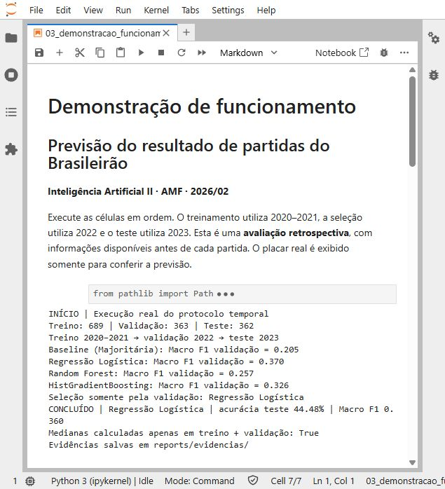
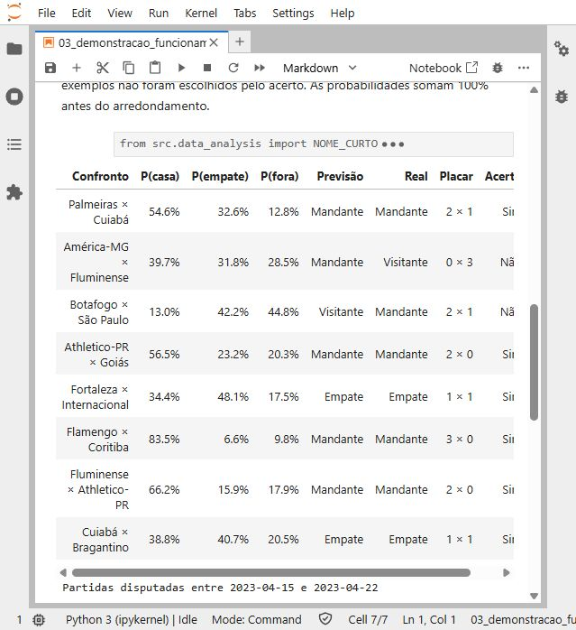

Previsão de resultados do
Brasileirão Série A

Classificação multiclasse com dados históricos de 2020 a 2023

**Trabalho 1 - Inteligência Artificial II**
Antonio Meneghetti Faculdade (AMF) • 2026/02
21 de setembro de 2026

**Integrantes**
Marcelo da Costa Telles
Arthur Zanon
Milton Roberto

Resumo

Este trabalho investiga a previsão do resultado de partidas de futebol antes de sua realização, distinguindo vitória do mandante, empate e vitória do visitante. A base contém 1.520 partidas de quatro temporadas do Campeonato Brasileiro Série A. Após exigir histórico mínimo, 1.414 partidas foram utilizadas na modelagem, com separação temporal entre treinamento, validação e teste.

Foram comparados uma referência majoritária, Regressão Logística, Random Forest e HistGradientBoosting. A Regressão Logística foi selecionada pelo maior Macro F1 na validação. No teste de 2023, atingiu **44,48% de acurácia e Macro F1 de 0,360**. O modelo reconhece mais classes que a referência majoritária, mas acerta menos partidas no total. Uma referência de frequências históricas também apresentou melhores métricas probabilísticas.

Objetivo e escopo

O objetivo é implementar e avaliar um processo supervisionado reproduzível, com atributos disponíveis antes de cada jogo, e analisar seus limites de generalização. A unidade de análise é uma partida; o alvo é determinado pelo placar final. As probabilidades estimadas permitem examinar a incerteza entre as três classes. A demonstração é retrospectiva e não constitui um serviço de previsão em tempo real.

| Base original | Base elegível | Teste independente |

| --- | --- | --- |

| 1.520 partidas / 26 clubes | 1.414 partidas / 34 atributos | 362 partidas de 2023 |

Organização: dados e EDA (p. 2); preparação (p. 3); protocolo e modelos (p. 4); validação (p. 5); teste (p. 6); interpretação (p. 7); evidências (p. 8-9); reprodução e referências (p. 10).

1. Dataset e análise exploratória

O arquivo **partidas_20_23.csv** reúne 1.520 linhas e 17 colunas, com 380 partidas por temporada, 26 clubes distintos e datas de 08/08/2020 a 06/12/2023. Contém equipes, placares, data e horário, público, listas de eventos e links das partidas. Os links apontam para o domínio Opta Player Stats / Stats Perform; essa é a origem identificável nos registros. O repositório não inclui o procedimento original de coleta nem uma licença específica da base.

A base foi escolhida por oferecer um alvo objetivo e sequências temporais por equipe que permitem construir atributos de desempenho anterior. O CSV processado preserva as 1.520 partidas e possui 66 colunas; o filtro de elegibilidade é aplicado posteriormente.

**Acesso aos dados:** <link href="https://github.com/ZanonDeAndrade/trabalhoIA/blob/91aec50/partidas_20_23.csv" color="#12688D">CSV original no repositório do projeto</link>. Fonte identificada nos links: <link href="https://optaplayerstats.statsperform.com/" color="#12688D">Opta Player Stats / Stats Perform</link>.

| Indicador | Resultado e tratamento |

| --- | --- |

| Classes | 691 vitórias do mandante (45,5%); 427 empates (28,1%); 402 vitórias do visitante (26,4%). |

| Gols | 3.637 gols; média de 2,39 por jogo. A maior contagem foi 10 gols; valores extremos foram preservados. |

| Público ausente | 613 partidas (40,3%): 380 em 2020, 218 em 2021, 2 em 2022 e 13 em 2023. Ausência não foi substituída por zero. |

| Temporada e calendário | 112 jogos da temporada 2020 ocorreram em 2021. A temporada foi recuperada do link, evitando confundir competição e ano civil. |

| Eventos disciplinares | 7.474 amarelos e 447 expulsões contabilizadas. Os registros incluem membros da comissão técnica; não representam necessariamente jogadores expulsos. |

Figura 1. Distribuição das classes na base completa. O desequilíbrio motiva avaliar Macro F1 além da acurácia.

As relações com público e disciplina são exploratórias. A ausência de público é concentrada por temporada e não deve ser tratada como aleatória; associações observadas não estabelecem causalidade.

2. Preparação e prevenção de informação futura

A preparação converte datas e placares, interpreta listas de eventos, organiza as partidas cronologicamente e deriva o alvo. Os eventos de gol contra são atribuídos à equipe beneficiada no registro. Na contagem de expulsões, sobreposições entre amarelo e segundo amarelo são tratadas para evitar dupla contagem do mesmo evento.

Históricos por equipe

As médias e contagens dos últimos cinco jogos utilizam deslocamento de uma partida (**shift(1)**): a partida a prever não contribui para seus próprios atributos. Exige-se um mínimo de cinco jogos anteriores por equipe. O histórico continua entre temporadas consecutivas e reinicia quando há uma temporada inteira sem participação. Para aproveitamento no mando específico, são usados de três a cinco jogos anteriores no contexto correspondente.

| Grupo | Conteúdo |

| --- | --- |

| 22 históricos numéricos | Para cada equipe: pontos, vitórias, empates, derrotas, gols marcados e sofridos, saldo, amarelos, expulsões e aproveitamento; mais aproveitamento do mandante em casa e do visitante fora. |

| 2 atributos de calendário | Mês e hora da partida. |

| 7 atributos derivados | Seis diferenças entre históricos das equipes e uma soma de gols marcados pelo mandante com gols sofridos pelo visitante. |

| 3 atributos categóricos | Equipe mandante, equipe visitante e dia da semana. |

São **34 atributos de entrada: 31 numéricos e 3 categóricos**, antes da expansão one-hot. A variável chamada expectativa_total_gols_ultimos_5 é, na implementação, uma soma voltada ao ataque do mandante; não representa uma estimativa completa de gols das duas equipes.

Ausências e transformações

O filtro utilizavel_ml retém 1.414 partidas e exclui 106 sem histórico geral suficiente. Ainda existem 24 partidas elegíveis com ausências em atributos de mando: 16 no treino, 4 na validação e 4 no teste. Elas são mantidas e imputadas pela mediana aprendida somente na partição de treinamento do pipeline.

A Regressão Logística aplica StandardScaler aos atributos numéricos; os modelos de árvore recebem números imputados sem padronização. OneHotEncoder codifica as categorias e ignora categorias desconhecidas. Imputação, escala e codificação são ajustadas dentro do Pipeline. A execução confirmou que as medianas do ajuste final coincidem com as medianas de treino mais validação.

Placar, resultado, público e eventos da própria partida ficam fora das entradas preditivas. Os históricos do teste podem utilizar jogos anteriores de 2023 já encerrados: o cenário é previsão antes de cada partida, não previsão de toda a temporada no primeiro dia. As verificações temporais sustentam esse desenho; não equivalem a uma garantia universal contra todo tipo de vazamento.

3. Estratégia experimental e algoritmos

| Etapa | Temporadas | Partidas | Mandante / empate / visitante |

| --- | --- | --- | --- |

| Treinamento inicial | 2020-2021 | 689 | 314 / 199 / 176 |

| Validação e seleção | 2022 | 363 | 161 / 102 / 100 |

| Teste final | 2023 | 362 | 170 / 94 / 98 |

| Retreino do selecionado | 2020-2022 | 1.052 | 475 / 301 / 276 |

Os modelos são ajustados em 2020-2021 e comparados em 2022. A seleção usa o maior **Macro F1** entre os três modelos candidatos, excluindo a referência majoritária. O selecionado é reajustado com 2020-2022 e avaliado em 2023. Não há sorteio de partidas entre períodos.

| Algoritmo | Configuração utilizada | Justificativa |

| --- | --- | --- |

| DummyClassifier | strategy=most_frequent | Quantifica o resultado de sempre prever a classe mais comum no treino. |

| Regressão Logística | solver=lbfgs; C=0,5; max_iter=1000; regularização L2; seed=42 | Modelo linear probabilístico; a regularização contém a complexidade em uma base pequena. |

| Random Forest | 200 árvores; max_depth=6; min_samples_leaf=8; seed=42; n_jobs=-1 | Captura relações não lineares, com profundidade e folhas limitadas para reduzir sobreajuste. |

| HistGradientBoosting | max_iter=120; max_depth=4; min_samples_leaf=15; learning_rate=0,05; seed=42 | Avalia um conjunto sequencial de árvores e interações entre atributos. |

Os hiperparâmetros foram fixados no código. **Não foi realizada busca sistemática de hiperparâmetros nem calibração de probabilidades.** Existe suporte para criar divisões walk-forward, mas a comparação reportada utiliza uma validação temporal fixa; não houve treinamento e avaliação em múltiplas janelas.

Métricas

**Acurácia** mede a proporção de acertos. **Acurácia balanceada** é a média do recall das três classes. **Macro F1** é a média dos F1 por classe, dando igual peso a cada resultado. **Log-Loss** usa o logaritmo natural da probabilidade da classe verdadeira. **Brier multiclasse** é a média da soma dos erros quadráticos nas três probabilidades, sem divisão adicional por dois (intervalo 0 a 2). Para Log-Loss e Brier, valores menores são melhores.

A referência adicional strategy=prior usa frequências de classes aprendidas em 2020-2022. Ela foi incluída na análise crítica probabilística, sem alterar o modelo selecionado ou ajustar hiperparâmetros pelo teste.

4. Resultados de validação e sobreajuste

| Modelo | Acurácia | Bal. acc. | Macro F1 | Log-Loss | Brier |

| --- | --- | --- | --- | --- | --- |

| Baseline (Majoritária) | 44,35% | 33,33% | 0,205 | 20,057 | 1,113 |

| Regressão Logística | 41,60% | 37,42% | 0,370 | 1,122 | 0,674 |

| Random Forest | 43,53% | 33,92% | 0,257 | 1,059 | 0,639 |

| HistGradientBoosting | 37,19% | 33,22% | 0,326 | 1,172 | 0,700 |

A Regressão Logística obteve o maior Macro F1 (0,370) e foi selecionada. Essa decisão depende da métrica escolhida: a Random Forest apresentou menor Log-Loss e Brier na validação. Nenhum candidato superou a referência majoritária em acurácia nessa etapa.

Figura 2. Comparação dos modelos em 2022, com parâmetros ajustados somente em 2020-2021.

Comparação com o desempenho de treinamento

| Modelo | Acurácia treino | Acurácia validação | Macro F1 treino / validação |

| --- | --- | --- | --- |

| Regressão Logística | 56,31% | 41,60% | 0,512 / 0,370 |

| Random Forest | 58,49% | 43,53% | 0,503 / 0,257 |

| HistGradientBoosting | 91,00% | 37,19% | 0,909 / 0,326 |

O HistGradientBoosting alcançou 91,00% de acurácia no treino e 37,19% na validação, evidenciando forte sobreajuste. A Regressão Logística também perde desempenho fora do treino: 56,31% para 41,60%. Logo, os limites de generalização permanecem mesmo no modelo escolhido. As métricas de treino são medidas sobre as próprias observações usadas no ajuste e não substituem a avaliação temporal.

5. Avaliação final em 2023

| Modelo / referência | Acurácia | Macro F1 | Log-Loss | Brier |

| --- | --- | --- | --- | --- |

| Regressão Logística | 44,48% | 0,360 | 1,089 | 0,652 |

| Sempre mandante | 46,96% | 0,213 | 19,117 | 1,061 |

| Frequências históricas | 46,96% | 0,213 | 1,061 | 0,640 |

A Regressão Logística acertou **161 de 362 jogos**; a classe majoritária acertou 170. A diferença é de -2,49 pontos percentuais de acurácia. Em contrapartida, o Macro F1 aumenta de 0,213 para 0,360 e a acurácia balanceada de 33,33% para 37,26%, pois o modelo passa a reconhecer empates e vitórias de visitantes.

Figura 3. Matriz de confusão do teste. Linhas representam a classe verdadeira; colunas, a prevista.

| Classe verdadeira | Acertos / total | Recall | F1 |

| --- | --- | --- | --- |

| Vitória mandante | 123 / 170 | 72,4% | 0,594 |

| Empate | 15 / 94 | 16,0% | 0,221 |

| Vitória visitante | 23 / 98 | 23,5% | 0,264 |

O ganho em Macro F1 não demonstra superioridade geral. Empates e vitórias de visitantes continuam difíceis. A referência de frequências históricas apresenta Log-Loss de 1,061 e Brier de 0,640, melhores que 1,089 e 0,652 do modelo. O Log-Loss elevado da referência majoritária (19,117) decorre das probabilidades zero para outras classes, limitadas numericamente na avaliação.

Após o retreino em 1.052 jogos, a Regressão Logística obteve 53,42% de acurácia e Macro F1 de 0,485 no próprio treino, contra 44,48% e 0,360 no teste. O teste foi preservado para avaliação; não houve reajuste posterior do modelo com base nesses resultados.

6. Interpretação, limitações e conclusão

Figura 4. Média do valor absoluto dos coeficientes da Regressão Logística entre as classes. Esse resumo não equivale a importância causal ou importância por permutação.

Os 15 maiores valores do resumo são indicadores categóricos de equipes e dia da semana. O maior é o indicador de Chapecoense como mandante (0,724), seguido de Flamengo como mandante (0,415) e Atlético-MG como mandante (0,411). Portanto, o gráfico não sustenta que os diferenciais de pontos e saldo de gols sejam os atributos de maior magnitude.

Coeficientes de variáveis correlacionadas e indicadores one-hot devem ser interpretados com cautela. A escala dos indicadores difere da escala padronizada dos atributos numéricos, e a média absoluta omite o sentido de cada efeito por classe. Os valores representam associações ajustadas no modelo, não causas dos resultados.

Limitações

A amostra cobre quatro temporadas de uma única competição, com mudanças de elenco, técnico e participação dos clubes. O histórico curto não representa toda a força de uma equipe e a exclusão de jogos sem histórico reduz a cobertura. Não foram incorporados escalações, lesões, força do elenco ou outras informações externas. Cartões incluem comissão técnica e não medem diretamente desvantagem numérica em campo.

Não foram estimados intervalos de confiança, testes de significância da diferença entre modelos, calibração ou avaliação em várias temporadas de teste. As categorias desconhecidas são ignoradas pelo encoder e o comportamento em clubes novos merece análise específica. A origem de cada linha é rastreável pelo link, mas a coleta original e a licença da base não estão documentadas no repositório.

Conclusão

O trabalho implementa uma solução supervisionada funcional, com engenharia temporal, comparação de algoritmos e avaliação crítica. A Regressão Logística é a escolhida pelo critério de Macro F1 da validação, mas os resultados de teste não justificam afirmar que ela seja melhor em todos os aspectos. Como continuidade, recomenda-se avaliar múltiplas janelas temporais, melhorar atributos pré-jogo e estudar calibração usando somente dados anteriores ao teste reservado.

7. Evidência de funcionamento: execução

Captura real do JupyterLab após executar o notebook 03_demonstracao_funcionamento.ipynb. O registro mostra treinamento, comparação na validação e teste do modelo selecionado. A execução foi concluída em **21/09/2026 às 09:32:55 (UTC-3)**, com kernel sem erro.

Figura 5. Execução real dos quatro algoritmos e resultado final. Arquivo original: reports/evidencias/01_execucao_modelos.png.

As métricas completas, as versões utilizadas, os tamanhos das partições e o hash SHA-256 do CSV estão registrados em reports/evidencias/metricas_execucao.json. O notebook preserva as saídas das células executadas.

8. Evidência de funcionamento: previsões

A captura mostra as oito primeiras partidas elegíveis do teste, em ordem cronológica, entre 15/04/2023 e 22/04/2023. O modelo fornece probabilidades para cada resultado e a classe de maior probabilidade. O resultado e o placar reais aparecem somente para conferência posterior.

Figura 6. Saída real com probabilidades, previsão e resultado observado. A coluna auxiliar de acerto está parcialmente fora do enquadramento; previsão e resultado permanecem visíveis.

Os exemplos incluem acertos e erros: América-MG x Fluminense e Botafogo x São Paulo foram classificados incorretamente. O subconjunto de oito jogos é uma demonstração de saída e não substitui a avaliação das 362 partidas. Todos os campos estão disponíveis em reports/evidencias/previsoes_exemplo.json.

9. Reprodução, organização e referências

Ambiente verificado

Python 3.14.3; NumPy 2.5.3; pandas 3.0.6; scikit-learn 1.9.1. As demais dependências do experimento estão fixadas em requirements.txt. O PDF utiliza ReportLab 4.4.9, listado separadamente em reports/requirements_documentacao.txt.

Executar a partir da raiz do repositório

python -m venv .venv

.\.venv\Scripts\python.exe -m pip install -r requirements.txt

.\.venv\Scripts\python.exe src/data_analysis.py

.\.venv\Scripts\python.exe src/modeling.py

.\.venv\Scripts\python.exe src/documentation_evidence.py

.\.venv\Scripts\python.exe -m jupyter lab

No JupyterLab, abrir notebooks/03_demonstracao_funcionamento.ipynb e executar todas as células em ordem. O notebook realiza novamente o experimento e grava as evidências. Para reconstruir o PDF, instalar reports/requirements_documentacao.txt e executar python scripts/gerar_relatorio_tecnico.py. O gerador requer as imagens existentes, as evidências JSON e fontes Arial do Windows.

| Caminho | Finalidade |

| --- | --- |

| src/data_analysis.py | Limpeza, atributos históricos e figuras de EDA. |

| src/data_split.py | Atributos preditivos e separação temporal. |

| src/modeling.py | Treinamento, seleção e avaliação dos modelos. |

| src/documentation_evidence.py | Reprodução de métricas e exemplos da demonstração. |

| notebooks/01, 02 e 03 | EDA, modelagem e demonstração executável. |

| reports/relatorio_tecnico.pdf | Relatório consolidado para entrega. |

| reports/evidencias/ | Capturas reais, métricas e previsões em JSON. |

Referências e rastreabilidade

[1] Enunciado: Trabalho 1 - Inteligência Artificial II, 2026/02. Documento fornecido para a atividade.
[2] Código e dados do projeto: <link href="https://github.com/ZanonDeAndrade/trabalhoIA" color="#12688D">github.com/ZanonDeAndrade/trabalhoIA</link>. Base analisada a partir do estado 91aec50, com documentação e evidências adicionadas posteriormente.
[3] Stats Perform / Opta Player Stats: domínio presente na coluna link do CSV, <link href="https://optaplayerstats.statsperform.com/" color="#12688D">optaplayerstats.statsperform.com</link>.
[4] Artefatos locais de apoio: analise_exploratoria.md, estrategia_experimental.md e resultados_modelagem.md. Este relatório consolida a execução registrada em metricas_execucao.json e explicita as ressalvas de interpretação.

A atividade requer aprovação prévia do dataset e entrega do repositório conforme o enunciado. A geração destes artefatos não comprova aprovação docente, envio no Classroom ou participação individual registrada em commits. Essas etapas devem ser conferidas pela equipe antes da entrega.