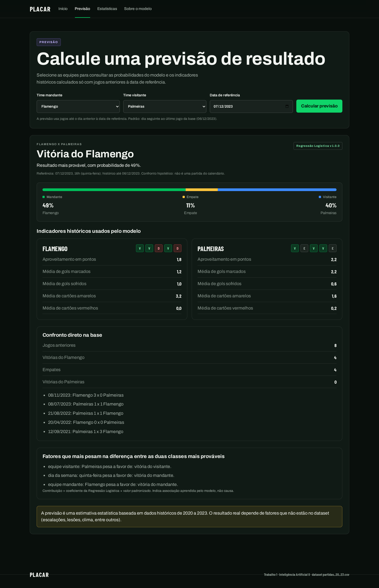
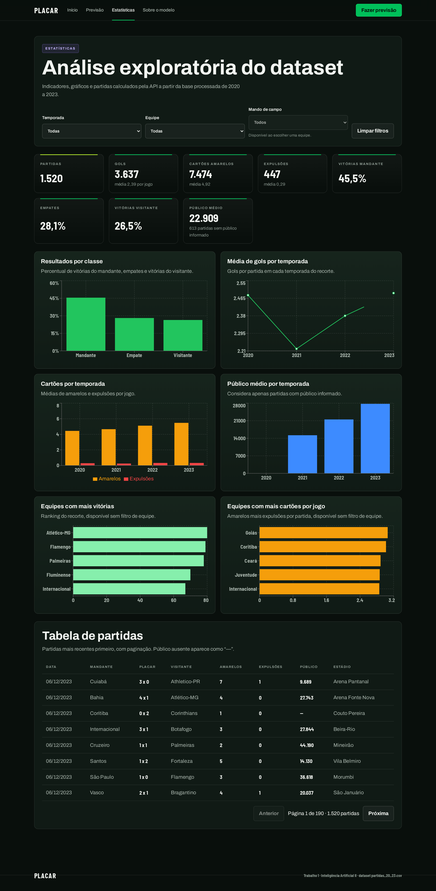
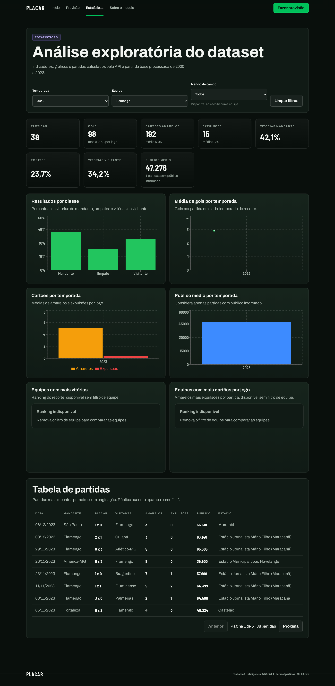
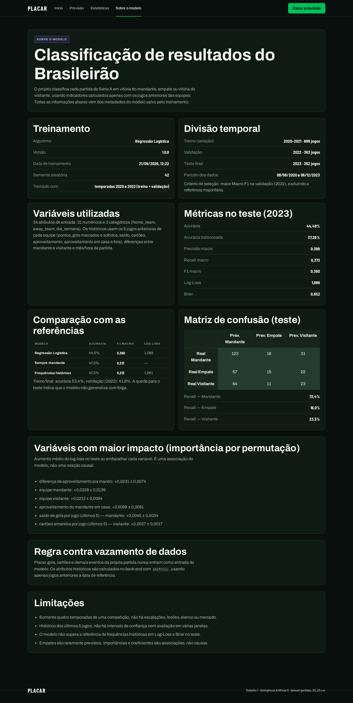
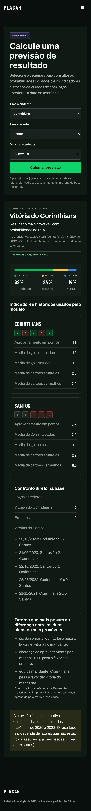

Previsão de resultados do
Brasileirão Série A

### Classificação multiclasse com dados históricos de 2020 a 2023

**Trabalho 1 - Inteligência Artificial II**
Antonio Meneghetti Faculdade (AMF) · 2026/02
21/09/2026

**Integrantes**
Marcelo da Costa Telles
Arthur Zanon
Milton Roberto

### Resumo

Este trabalho prevê o resultado de partidas do Campeonato Brasileiro Série A antes de sua realização, distinguindo vitória do mandante, empate e vitória do visitante. A base contém 1.520 partidas de quatro temporadas; 1.414 têm histórico suficiente e foram usadas na modelagem, com separação cronológica entre treinamento (689), validação (363) e teste (362).

Foram comparados 4 algoritmos (uma referência majoritária, Regressão Logística, Random Forest e HistGradientBoosting). Foi selecionado o modelo **Regressão Logística**, pelo maior Macro F1 na validação. No teste de 2023 obteve **44,48% de acurácia, Macro F1 de 0,360 e Log-Loss de 1,089**. A acurácia é inferior à da referência que sempre prevê o mandante (46,96%), embora o Macro F1 seja maior (0,360 contra 0,213). Uma referência de frequências históricas tem Log-Loss melhores (1,061). O modelo, portanto, não demonstra superioridade geral.

Além do modelo, o projeto inclui uma API (Python) que serve o modelo salvo e um front-end (React) para demonstração; ambos são descritos na seção de extensão.

| Base original | Base elegível | Teste independente | Modelo salvo |

| --- | --- | --- | --- |

| 1.520 partidas / 26 clubes | 1.414 partidas / 34 atributos | 362 partidas de 2023 | models/model.joblib (v1.0.0) |

Organização: 1 Dataset · 2 Problema e objetivo · 3 Exploração e preparação · 4 Estratégia experimental · 5 Modelagem · 6 Avaliação · 7 Análise dos resultados · 8 Demonstração de funcionamento · 9 Extensão opcional · 10 Limitações · 11 Referências e reprodução.

## 1. Dataset

O arquivo **partidas_20_23.csv** reúne 1.520 linhas e 17 colunas, com 380 partidas por temporada, 26 clubes distintos e partidas de 08/08/2020 a 06/12/2023. Cada linha traz equipes, placar, data e horário, estádio, público, árbitro, listas JSON de gols e cartões e o link da partida. Os links apontam para o domínio Opta Player Stats / Stats Perform; essa é a origem identificável nos registros. O procedimento original de coleta e a licença específica da base não estão documentados no repositório.

**Validação do dataset:** o CSV original é lido somente para leitura e seu SHA-256 é registrado nos metadados do modelo; 14 verificações automáticas (contagens, placares não negativos, datas interpretadas, temporadas, ordem cronológica, identificadores únicos) são executadas por *src/data_analysis.py*. A aprovação do dataset pelo professor é uma etapa manual da equipe.

| Indicador | Resultado e tratamento |

| --- | --- |

| Classes | 691 vitória do mandante (45,5%); 427 empate (28,1%); 402 vitória do visitante (26,4%). |

| Gols | 3.637 gols; média de 2,39 por jogo; máximo de 10 em uma partida (valores extremos preservados). |

| Público ausente | 613 partidas (40,3%): 380 em 2020, 218 em 2021, 2 em 2022, 13 em 2023. Ausência não foi substituída por zero. |

| Temporada e calendário | 112 jogos da temporada 2020 ocorreram em 2021; a temporada é extraída do link, e não do ano da data. |

| Eventos disciplinares | 7.474 amarelos e 447 expulsões contabilizadas (incluem registros de comissão técnica). |

Figura 1. Distribuição das classes na base completa. O desequilíbrio motiva avaliar também o Macro F1.

Figura 2. Resultados por temporada.

Todas as figuras de exploração são geradas por *src/data_analysis.py* a partir dos dados reais e ficam em reports/figures.

## 2. Problema e objetivo

**Problema.** Classificação supervisionada multiclasse: dada uma partida ainda não disputada, estimar a classe do resultado final — vitória do mandante (*home_win*), empate (*draw*) ou vitória do visitante (*away_win*). O alvo é derivado do placar registrado; a versão numérica usada internamente é 0, 1 e 2, respectivamente.

**Objetivo.** Implementar e avaliar um processo reproduzível que use somente informações disponíveis antes de cada jogo e analisar criticamente seus limites de generalização, comparando algoritmos com referências simples.

**Escopo.** A unidade de análise é uma partida. As probabilidades estimadas permitem examinar a incerteza entre as três classes. A avaliação é retrospectiva; a demonstração na aplicação prevê confrontos hipotéticos a partir do histórico até o último jogo da base e não constitui um serviço de previsão em tempo real.

**Critérios de sucesso.** (i) evitar vazamento de dados; (ii) superar referências simples em ao menos uma métrica adequada ao desequilíbrio de classes; (iii) relatar honestamente onde o modelo não supera as referências.

## 3. Exploração e preparação dos dados

A exploração cobre dimensões, tipos, ausências, duplicidades, valores extremos (regra do IQR), distribuição das classes, gols e cartões por temporada, desempenho de mandantes e visitantes, rankings de equipes e público por temporada.

| Temporada | Gols por jogo | Amarelos por jogo | Expulsões por jogo | Público médio (informado) |

| --- | --- | --- | --- | --- |

| 2020 | 2,48 | 4,44 | 0,29 | sem dados |

| 2021 | 2,22 | 4,66 | 0,25 | 15.207 |

| 2022 | 2,38 | 5,11 | 0,32 | 21.505 |

| 2023 | 2,49 | 5,47 | 0,32 | 27.755 |

Figura 3. Cartões por temporada.

Figura 4. Equipes com mais vitórias no período.

### Preparação

As datas em português são convertidas por dicionário de meses; as listas JSON são interpretadas com *json.loads* (nunca *eval*), registrando inconsistências; o público com ponto de milhar é convertido e *No data* vira ausente; expulsões somam vermelhos diretos e segundos amarelos; gols contra e pênaltis são contados a partir dos campos *cont* e *penal*. Os nomes das equipes são padronizados e a variável-alvo deriva exclusivamente do placar.

### Atributos e prevenção de vazamento

As médias e contagens dos últimos cinco jogos usam **shift(1)** antes da janela móvel: a partida a prever não contribui para os próprios atributos. Exige-se histórico mínimo de cinco jogos; o histórico atravessa temporadas consecutivas e reinicia após uma temporada inteira sem jogos do clube. Placar, gols, cartões, totais e resultado da própria partida nunca são entradas; só servem para construir o histórico. Esse comportamento é verificado por testes automatizados (perturbação do placar da partida atual, recálculo independente das médias e conferência das colunas proibidas).

| Grupo | Conteúdo |

| --- | --- |

| 22 históricos numéricos | Por equipe: pontos, vitórias, empates, derrotas, gols marcados e sofridos, saldo, amarelos, expulsões e aproveitamento; mais aproveitamento do mandante em casa e do visitante fora. |

| 2 de calendário | Mês e hora da partida. |

| 7 derivados | Seis diferenças entre históricos do mandante e do visitante e uma soma de gols marcados pelo mandante com gols sofridos pelo visitante. |

| 3 categóricos | Equipe mandante, equipe visitante e dia da semana (codificados por one-hot). |

São **34 atributos de entrada: 31 numéricos e 3 categóricos**. O filtro *utilizavel_ml* retém 1.414 partidas e exclui 106 sem histórico suficiente. Há 24 partidas elegíveis com ausência nos atributos de mando (16 no treino, 4 na validação e 4 no teste); elas são mantidas e imputadas pela mediana aprendida somente no treinamento. A padronização (StandardScaler) é aplicada apenas ao modelo linear; valores extremos de gols foram preservados por serem resultados legítimos.

## 4. Estratégia experimental

| Etapa | Temporadas | Partidas | Mandante / empate / visitante |

| --- | --- | --- | --- |

| Treinamento inicial | 2020–2021 | 689 | 314 / 199 / 176 |

| Validação e seleção | 2022 | 363 | 161 / 102 / 100 |

| Teste final | 2023 | 362 | 170 / 94 / 98 |

| Retreino do selecionado | 2020–2022 | 1.052 | 475 / 301 / 276 |

A divisão é estritamente cronológica; não há sorteio de partidas entre períodos. Os candidatos são ajustados em 2020–2021 e comparados em 2022. A seleção usa o **maior Macro F1 na validação (2022), excluindo a referência majoritária**. O selecionado é reajustado com 2020–2022 e avaliado uma única vez em 2023: o teste não é usado para escolher modelo nem hiperparâmetros. O pré-processamento (imputação, escala e codificação) faz parte do *Pipeline* e é ajustado só com os dados de treinamento (verificado: as medianas do ajuste final coincidem com as de treino + validação: sim).

### Métricas

**Acurácia**; **acurácia balanceada** (média do recall das classes); **precisão macro**, **recall macro** e **Macro F1** (médias simples entre as classes); relatório por classe; matriz de confusão; **Log-Loss** e **Brier multiclasse** (menores são melhores; Brier de 0 a 2); **ROC AUC um-contra-todos** (macro); calibração (curvas em faixas de mesmo tamanho e erro de calibração esperado da classe prevista).

Não houve busca sistemática de hiperparâmetros, calibração das probabilidades nem avaliação em múltiplas janelas temporais; esses pontos estão listados nas limitações.

## 5. Modelagem

| Algoritmo | Hiperparâmetros | Tempo de ajuste | Justificativa |

| --- | --- | --- | --- |

| Baseline (Majoritária) | strategy=most_frequent | 0,005 s | Quantifica o resultado de sempre prever a classe mais comum no treino. |

| Regressão Logística | C=0.5; max_iter=1000; random_state=42; solver=lbfgs | 0,023 s | Modelo linear probabilístico; a regularização L2 limita a complexidade em uma base pequena. |

| Random Forest | max_depth=6; min_samples_leaf=8; n_estimators=200; n_jobs=-1; random_state=42 | 0,286 s | Captura relações não lineares; profundidade e folhas limitadas para reduzir sobreajuste. |

| HistGradientBoosting | learning_rate=0.05; max_depth=4; max_iter=120; min_samples_leaf=15; random_state=42 | 0,314 s | Conjunto sequencial de árvores; avalia interações entre atributos. |

Pré-processamento: imputação pela mediana em todos os modelos; StandardScaler apenas na Regressão Logística; OneHotEncoder (categorias desconhecidas ignoradas). Semente aleatória: 42. Ambiente: Python 3.14.4, NumPy 2.5.3, pandas 3.0.6, scikit-learn 1.9.1.

O modelo final (Regressão Logística, reajustado em 2020–2022, 0.030 s) é salvo em *models/model.joblib* com metadados em *models/metadata.json* (versão, data de treinamento, algoritmo, hiperparâmetros, atributos, classes, métricas, período dos dados, semente e versões das dependências), e é o mesmo artefato usado pela API.

## 6. Avaliação

### Validação (2022) e comparação com o treino

| Modelo | Acurácia treino | Acurácia val. | Bal. acc. val. | Prec. macro | Recall macro | Macro F1 | Log-Loss |

| --- | --- | --- | --- | --- | --- | --- | --- |

| Baseline (Majoritária) | 45,57% | 44,35% | 33,33% | 0,148 | 0,333 | 0,205 | n/a |

| Regressão Logística | 56,31% | 41,60% | 37,42% | 0,381 | 0,374 | 0,370 | 1,122 |

| Random Forest | 58,49% | 43,53% | 33,92% | 0,301 | 0,339 | 0,257 | 1,059 |

| HistGradientBoosting | 91,00% | 37,19% | 33,22% | 0,336 | 0,332 | 0,326 | 1,172 |

Figura 5. Comparação dos modelos na validação (parâmetros ajustados somente em 2020-2021).

### Teste final (2023)

| Modelo / referência | Acurácia | Bal. acc. | Prec. macro | Recall macro | Macro F1 | Log-Loss | Brier | AUC |

| --- | --- | --- | --- | --- | --- | --- | --- | --- |

| Regressão Logística | 44,48% | 37,26% | 0,388 | 0,373 | 0,360 | 1,089 | 0,652 | 0,559 |

| Sempre mandante | 46,96% | 33,33% | 0,157 | 0,333 | 0,213 | n/a | n/a | 0,500 |

| Frequências históricas | 46,96% | 33,33% | 0,157 | 0,333 | 0,213 | 1,061 | 0,640 | 0,500 |

| Classe verdadeira | Acertos / total | Precisão | Recall | F1 | Previsões do modelo |

| --- | --- | --- | --- | --- | --- |

| Vitória do mandante | 123 / 170 | 0,504 | 0,724 | 0,594 | 244 |

| Empate | 15 / 94 | 0,357 | 0,160 | 0,221 | 42 |

| Vitória do visitante | 23 / 98 | 0,303 | 0,235 | 0,264 | 76 |

Figura 6. Matriz de confusão do teste (linhas: classe verdadeira; colunas: classe prevista).

## 7. Análise dos resultados

### Comparação com as referências

O modelo acertou **161 de 362 jogos**; a referência majoritária acertou 170. A diferença de acurácia é de -2,49 pontos percentuais. Em contrapartida, o Macro F1 passa de 0,213 para 0,360 e a acurácia balanceada de 33,33% para 37,26%: o modelo passa a reconhecer empates e vitórias de visitantes. O ROC AUC macro é 0,559, próximo de 0,5, o que indica baixo poder de ordenação. A referência de frequências históricas apresenta Log-Loss de 1,061 e Brier de 0,640, melhores que os 1,089 e 0,652 do modelo. Na validação, o menor Log-Loss foi de Random Forest: a escolha pelo Macro F1 é uma decisão de critério, não de superioridade geral.

### Overfitting e generalização

Figura 7. Desempenho do modelo selecionado em treino, validação e teste.

A acurácia cai do treino para a validação em todos os modelos; a maior queda é a do HistGradientBoosting (91,00% → 37,19%), o que indica sobreajuste. No modelo selecionado, a acurácia vai de 56,31% (treino 2020–21) para 41,60% (validação) e 53,42% (treino final) contra 44,48% no teste. Métricas de treino medem os dados usados no ajuste e não substituem a avaliação temporal.

### Classes mais difíceis e erros

O recall foi de 72,4% para vitórias do mandante, 16,0% para empates e 23,5% para vitórias do visitante. O modelo previu empate em apenas 42 das 362 partidas (a maior probabilidade de empate atribuída foi 59,3%); como o empate raramente é a classe mais provável, ele é pouco previsto. As confusões mais frequentes foram: vitória do visitante previsto como vitória do mandante (64 partidas), empate previsto como vitória do mandante (57 partidas).

Figura 8. Distribuição das previsões e dos resultados reais no teste.

| Data | Confronto | Placar | Previsto | Real | Confiança |

| --- | --- | --- | --- | --- | --- |

| 08/10/2023 | Atlético-MG x Coritiba | 1 x 2 | Vitória do mandante | Vitória do visitante | 88,5% |

| 08/11/2023 | América-MG x Coritiba | 0 x 3 | Vitória do mandante | Vitória do visitante | 80,1% |

| 29/10/2023 | Internacional x Coritiba | 3 x 4 | Vitória do mandante | Vitória do visitante | 78,0% |

| 16/07/2023 | Cruzeiro x Coritiba | 0 x 0 | Vitória do mandante | Empate | 73,0% |

| 08/11/2023 | Athletico-PR x Fortaleza | 1 x 1 | Vitória do mandante | Empate | 71,8% |

A tabela lista as previsões erradas em que o modelo atribuiu maior probabilidade à classe prevista. Não foram investigadas as causas de cada erro; possíveis fatores gerais são a alta variância do futebol e a ausência, no dataset, de escalações, lesões e contexto do jogo. Os acertos de maior confiança estão em reports/evidencias/metricas_execucao.json.

### Interpretação (associação, não causalidade)

Figura 9. Importância por permutação no teste (aumento médio do log-loss; barras: desvio padrão de 30 repetições).

Os atributos de maior impacto foram: diferença de aproveitamento por mando (+0,0231); equipe mandante (+0,0228); equipe visitante (+0,0212). Os desvios são grandes em relação às médias, e atributos correlacionados dividem a importância; os resultados descrevem o comportamento do modelo, não causas dos resultados. Os coeficientes da Regressão Logística por classe (reports/figures/17) mostram a direção do efeito condicional de cada atributo padronizado, mas indicadores de equipes e do dia da semana têm escala diferente dos numéricos.

Figura 10. Calibração no teste; ECE da classe prevista = 0,080, com 5 faixas (amostra pequena: curvas ruidosas).

## 8. Demonstração de funcionamento

A aplicação foi executada de ponta a ponta (API + front-end) e as capturas abaixo foram feitas automaticamente pelo script *scripts/capturar_screenshots.py* com o navegador Chromium, sem edição. Todas as probabilidades, tabelas e gráficos vêm da API; não há dados simulados no front-end. Há também o notebook *03_demonstracao_funcionamento.ipynb*, executado do início ao fim.

Figura 11. Página inicial: indicadores e métricas reais lidos da API (topo da página).

Figura 12. Previsão de Flamengo x Palmeiras: equipes, data de referência e as três probabilidades.

Figura 13. Comparação histórica: forma recente, médias dos últimos 5 jogos e confronto direto.

Figura 14. Estatísticas: indicadores e gráficos calculados pela API (topo da página).

Figura 15. Estatísticas filtradas por temporada 2023 e equipe Flamengo (topo da página).

Figura 16. Sobre o modelo: algoritmo, divisão temporal e métricas reais (topo da página).

Figura 17. Uso em celular (390 px): sem rolagem horizontal (topo da página).

As imagens completas estão em reports/screenshots/. As capturas do JupyterLab de execuções anteriores permanecem em reports/evidencias/.

## 9. Extensão opcional: API e aplicação web

Como extensão, o modelo foi disponibilizado por uma API HTTP (Python, biblioteca padrão) e uma interface web (React + TypeScript + Vite). A API carrega *models/model.joblib* e a base processada uma única vez, valida entradas, restringe CORS às origens configuradas e responde erros em JSON sem expor detalhes internos.

Na previsão de um confronto, a API calcula os atributos com **o mesmo código do treinamento** sobre os jogos anteriores à data de referência; testes comprovam que os atributos coincidem com os do conjunto de treino nas 1.414 partidas elegíveis. Equipes sem cinco jogos ou sem jogos recentes são recusadas (HTTP 422) em vez de receberem valores inventados.

| Endpoint | Função |

| --- | --- |

| GET /api/health | Estado da API, do modelo e da base. |

| GET /api/model | Metadados e métricas reais do modelo. |

| GET /api/teams | Equipes e elegibilidade para previsão. |

| GET /api/teams/{id}/summary | Resumo de desempenho de uma equipe. |

| GET /api/teams/compare | Comparação e confronto direto. |

| GET /api/stats/overview · /charts | Indicadores e séries com filtros de temporada, equipe e mando. |

| GET /api/matches | Partidas paginadas. |

| POST /api/predict | Três probabilidades, classe prevista, forma recente, confronto direto e fatores. |

## 10. Limitações

• Base pequena: 1.520 partidas de uma única competição em quatro temporadas; mudanças de elenco, técnico e participação dos clubes não são modeladas.

• O histórico de cinco jogos é curto; não há escalações, lesões, força do elenco, mercado ou informações externas. Cartões incluem comissão técnica.

• Não houve busca sistemática de hiperparâmetros, calibração das probabilidades, intervalos de confiança, testes de significância entre modelos ou avaliação em várias janelas temporais.

• A avaliação em 2023 é sequencial: o histórico do teste usa jogos anteriores já encerrados em 2023, cenário coerente com a previsão antes de cada partida, não com a previsão de toda a temporada de uma vez.

• As verificações de vazamento (testes automatizados) sustentam o desenho, mas não são garantia universal contra todo tipo de vazamento.

• Confrontos hipotéticos na aplicação dependem da data de referência escolhida e assumem calendário e mando informados pelo usuário.

• A origem dos dados é identificável pelo link, mas a coleta original e a licença de uso não estão documentadas.

• Estimativas de interpretação são associações; os desvios da importância por permutação são grandes (0,0074, 0,0139, 0,0094 nos três primeiros).

### Conclusão

O trabalho entrega uma solução supervisionada reproduzível, com engenharia temporal sem vazamento, comparação de algoritmos, avaliação com várias métricas e interpretação crítica. O modelo selecionado (Regressão Logística) melhora o reconhecimento das três classes (Macro F1 0,360 contra 0,213), mas tem acurácia inferior à da referência majoritária e Log-Loss pior que o das frequências históricas. Como continuidade: avaliar múltiplas janelas temporais, incluir atributos pré-jogo adicionais, ajustar hiperparâmetros só com validação e calibrar probabilidades.

## 11. Referências e reprodução

### Ambiente e comandos

python -m venv .venv &amp;&amp; source .venv/bin/activate     # Windows: .venv\Scripts\activate

pip install -r requirements.txt -r requirements-dev.txt

python src/data_analysis.py      # EDA, base processada e figuras 01-13

python src/modeling.py           # treino, avaliação, modelo salvo e figuras 14-20

python -m pytest tests           # testes de dados, vazamento, modelo, previsão e API

python src/api.py                # API em http://127.0.0.1:8000/api

cd frontend &amp;&amp; npm install &amp;&amp; npm run dev     # interface em http://localhost:5173

python scripts/capturar_screenshots.py   # capturas reais (Playwright)

python scripts/gerar_relatorio_tecnico.py     # este relatório

make setup data train test run report              # atalhos equivalentes

Com o Makefile, *make all* executa dados, treino e testes. Detalhes no README.

### Estrutura do repositório

| Caminho | Finalidade |

| --- | --- |

| src/data_analysis.py, data_split.py | Limpeza, atributos históricos, EDA e separação temporal. |

| src/modeling.py, evaluation.py | Treinamento, seleção, métricas, interpretação e persistência. |

| src/api.py, predictor.py, analytics.py | API, previsão com o modelo salvo e estatísticas. |

| frontend/ | Interface web e seus testes. |

| tests/ | Testes automatizados em Python. |

| models/ | Modelo salvo e metadados. |

| notebooks/ | EDA, modelagem e demonstração executados. |

| reports/ | Relatórios, figuras, evidências e capturas. |

### Referências

[1] Enunciado: Trabalho 1 - Inteligência Artificial II, 2026/02. Documento fornecido para a atividade.
[2] Código e dados do projeto: github.com/ZanonDeAndrade/trabalhoIA.
[3] Stats Perform / Opta Player Stats: domínio presente na coluna link do CSV (optaplayerstats.statsperform.com).
[4] Pedregosa et al. Scikit-learn: Machine Learning in Python. JMLR 12, 2011.
[5] Documentação do scikit-learn: Pipeline, LogisticRegression, permutation_importance e calibration_curve.

A atividade exige aprovação prévia do dataset e entrega do repositório conforme o enunciado. Este relatório não comprova aprovação docente, envio no Classroom nem a contribuição individual de cada integrante; essas etapas devem ser conferidas pela equipe.