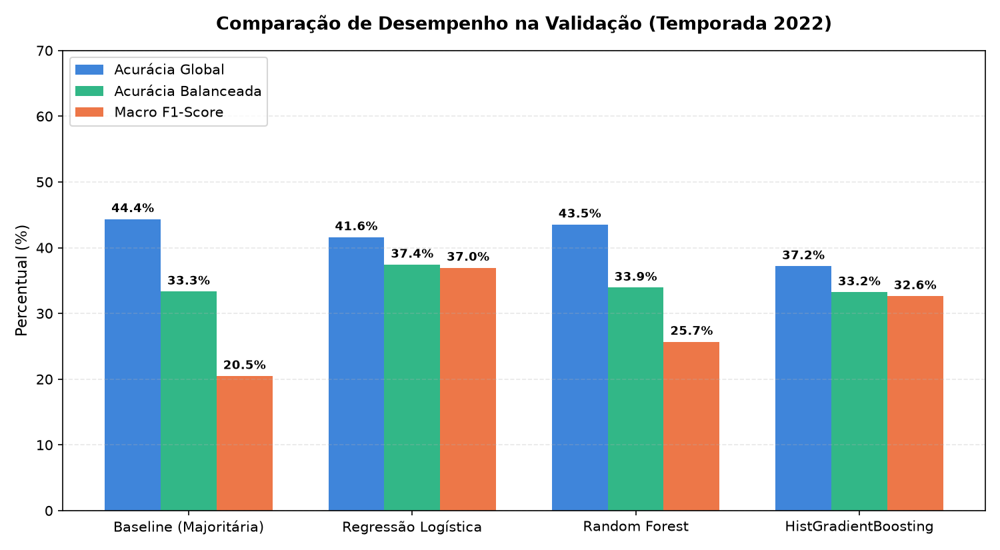
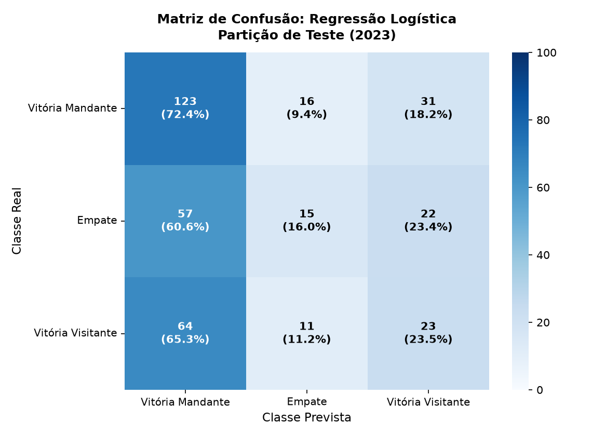
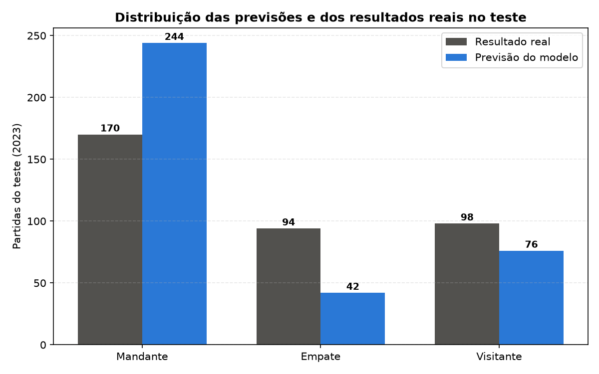
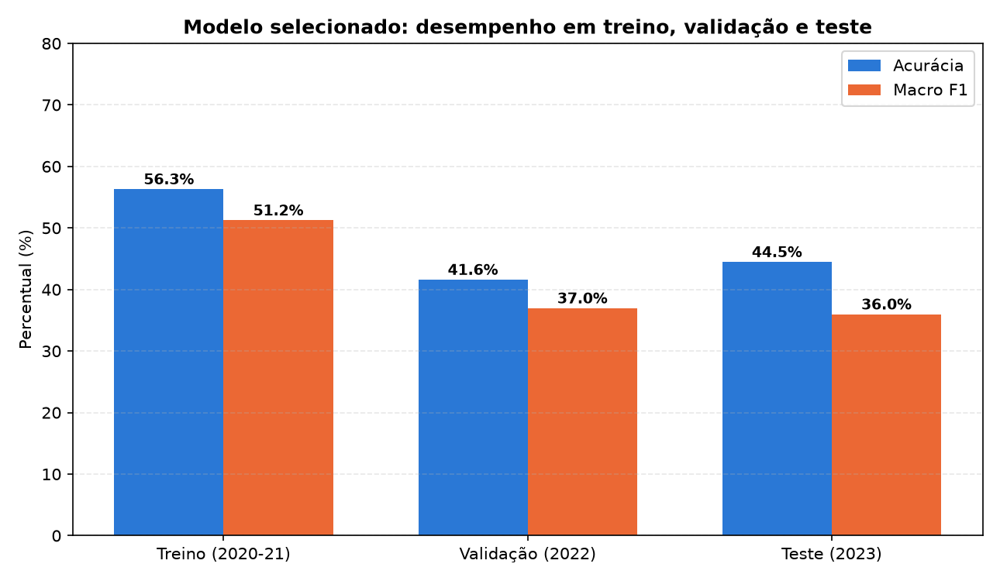
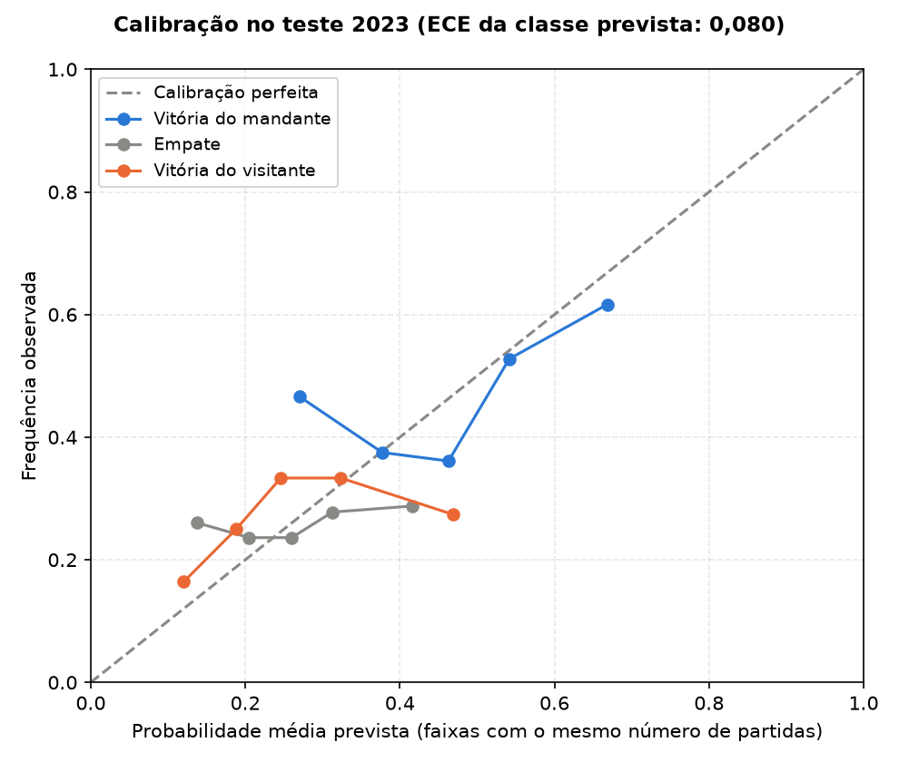
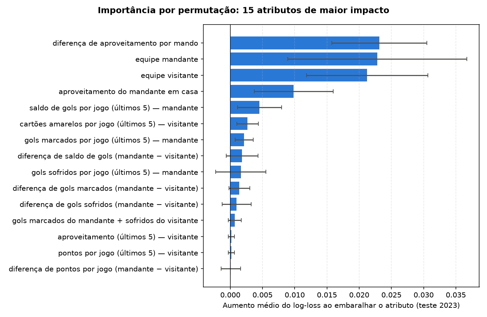

# Relatório de modelagem — Brasileirão Série A (2020–2023)

Este arquivo é **gerado por `python src/modeling.py`**; todos os números vêm da execução registrada em `reports/evidencias/metricas_execucao.json` (executada em 2026-09-21T12:22:57-03:00).

## 1. Protocolo

- Treino: temporadas 2020–2021 (689 partidas).
- Validação e seleção: 2022 (363 partidas).
- Teste: 2023 (362 partidas), usado uma única vez após a escolha.
- Reajuste do modelo selecionado: 2020–2022 (1052 partidas).
- Critério de seleção: maior Macro F1 na validação (2022), excluindo a referência majoritária.

## 2. Modelos, hiperparâmetros e tempo de treinamento

| Modelo | Hiperparâmetros principais | Tempo de ajuste (2020–2021) |
|---|---|---|
| Baseline (Majoritária) | strategy=most_frequent | 0.005 s |
| Regressão Logística | C=0.5, max_iter=1000, random_state=42, solver=lbfgs | 0.023 s |
| Random Forest | max_depth=6, min_samples_leaf=8, n_estimators=200, random_state=42 | 0.286 s |
| HistGradientBoosting | learning_rate=0.05, max_depth=4, max_iter=120, min_samples_leaf=15, random_state=42 | 0.314 s |

## 3. Desempenho por partição

| Modelo | Partição | Acurácia | Acurácia bal. | Precisão macro | Recall macro | Macro F1 | Log-Loss | Brier |
|---|---|---|---|---|---|---|---|---|
| Baseline (Majoritária) | Treino 2020–21 | 45.57% | 33.33% | 0.152 | 0.333 | 0.209 | 19.617 | 1.089 |
| Baseline (Majoritária) | Validação 2022 | 44.35% | 33.33% | 0.148 | 0.333 | 0.205 | 20.057 | 1.113 |
| Regressão Logística | Treino 2020–21 | 56.31% | 51.07% | 0.551 | 0.511 | 0.512 | 0.929 | 0.553 |
| Regressão Logística | Validação 2022 | 41.60% | 37.42% | 0.381 | 0.374 | 0.370 | 1.122 | 0.674 |
| Random Forest | Treino 2020–21 | 58.49% | 50.24% | 0.734 | 0.502 | 0.503 | 0.915 | 0.542 |
| Random Forest | Validação 2022 | 43.53% | 33.92% | 0.301 | 0.339 | 0.257 | 1.059 | 0.639 |
| HistGradientBoosting | Treino 2020–21 | 91.00% | 89.71% | 0.926 | 0.897 | 0.909 | 0.539 | 0.285 |
| HistGradientBoosting | Validação 2022 | 37.19% | 33.22% | 0.336 | 0.332 | 0.326 | 1.172 | 0.700 |

**Modelo selecionado:** Regressão Logística. A escolha pelo Macro F1 não implica superioridade em todas as métricas.

## 4. Avaliação final no teste (2023)

| Métrica | Baseline majoritária | Frequências históricas | Regressão Logística |
|---|---|---|---|
| Acurácia | 46.96% | 46.96% | **44.48%** |
| Acurácia balanceada | 33.33% | 33.33% | **37.26%** |
| Precisão macro | 0.157 | 0.157 | **0.388** |
| Recall macro | 0.333 | 0.333 | **0.373** |
| Macro F1 | 0.213 | 0.213 | **0.360** |
| Log-Loss | — | 1.061 | **1.089** |
| Brier | — | 0.640 | **0.652** |
| ROC AUC (um-contra-todos, macro) | — | 0.500 | **0.559** |

Log-Loss e Brier não se aplicam à baseline majoritária (probabilidades 0 ou 1).

### Métricas por classe (teste)

| Classe | Precisão | Recall | F1 | Suporte |
|---|---|---|---|---|
| Vitória do mandante | 0.504 | 0.724 | 0.594 | 170 |
| Empate | 0.357 | 0.160 | 0.221 | 94 |
| Vitória do visitante | 0.303 | 0.235 | 0.264 | 98 |

### Matriz de confusão (teste)

| Real \ Previsto | Mandante | Empate | Visitante | Total |
|---|---|---|---|---|
| Vitória do mandante | 123 (72.4%) | 16 (9.4%) | 31 (18.2%) | 170 |
| Empate | 57 (60.6%) | 15 (16.0%) | 22 (23.4%) | 94 |
| Vitória do visitante | 64 (65.3%) | 11 (11.2%) | 23 (23.5%) | 98 |

## 5. Interpretação

Importância por permutação e coeficientes descrevem associações do modelo; **não são causalidade**.

| Atributo | Aumento do log-loss ± desvio |
|---|---|
| diferença de aproveitamento por mando | 0.0231 ± 0.0074 |
| equipe mandante | 0.0228 ± 0.0139 |
| equipe visitante | 0.0212 ± 0.0094 |
| aproveitamento do mandante em casa | 0.0098 ± 0.0061 |
| saldo de gols por jogo (últimos 5) — mandante | 0.0045 ± 0.0034 |
| cartões amarelos por jogo (últimos 5) — visitante | 0.0027 ± 0.0017 |
| gols marcados por jogo (últimos 5) — mandante | 0.0021 ± 0.0014 |
| diferença de saldo de gols (mandante − visitante) | 0.0018 ± 0.0025 |
| gols sofridos por jogo (últimos 5) — mandante | 0.0016 ± 0.0039 |
| diferença de gols marcados (mandante − visitante) | 0.0014 ± 0.0016 |

## 6. Erros mais confiantes no teste

| Data | Confronto | Placar | Previsto | Real | Confiança |
|---|---|---|---|---|---|
| 2023-10-08 | Atlético-MG x Coritiba | 1 x 2 | Vitória do mandante | Vitória do visitante | 88.5% |
| 2023-11-08 | América-MG x Coritiba | 0 x 3 | Vitória do mandante | Vitória do visitante | 80.1% |
| 2023-10-29 | Internacional x Coritiba | 3 x 4 | Vitória do mandante | Vitória do visitante | 78.0% |
| 2023-07-16 | Cruzeiro x Coritiba | 0 x 0 | Vitória do mandante | Empate | 73.0% |
| 2023-11-08 | Athletico-PR x Fortaleza | 1 x 1 | Vitória do mandante | Empate | 71.8% |
