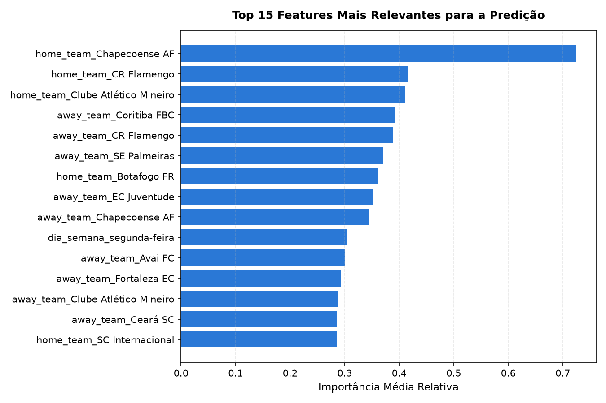

# Relatório de Modelagem Preditiva — Brasileirão Série A (2020–2023)

Disciplina de Inteligência Artificial II. Este documento consolida a etapa de treinamento, validação e teste de modelos preditivos multiclasse para os resultados das partidas do Campeonato Brasileiro, seguindo a partição temporal formalizada em `reports/estrategia_experimental.md`.

---

## 1. Modelos Avaliados

1. **Baseline Ingênua (Dummy):** Predição constante da classe majoritária (`home_win`), representando a referência básica a ser superada.
2. **Regressão Logística Multinomial:** Modelo linear regularizado L2 com padronização via `StandardScaler` e codificação de equipes via `OneHotEncoder`.
3. **Random Forest Classifier:** Conjunto de 200 árvores de decisão com controle de profundidade máxima (`max_depth=6`) para contenção de sobreajuste.
4. **HistGradientBoosting Classifier:** Modelo baseado em árvores com aumento de gradiente e regularização adaptada para matrizes tabulares.

---

## 2. Resultados da Fase de Validação (Temporada 2022)

Os modelos foram ajustados estritamente com as temporadas 2020 e 2021 (689 partidas) e avaliados na temporada de 2022 (363 partidas):

| Modelo | Acurácia Global | Acurácia Balanceada | Macro F1-Score | Log-Loss | Brier Score |
|---|---|---|---|---|---|
| **Baseline (Majoritária)** | 44.35% | 33.33% | 0.205 | 20.057 | 1.113 |
| **Regressão Logística** | 41.60% | 37.42% | 0.370 | 1.122 | 0.674 |
| **Random Forest** | 43.53% | 33.92% | 0.257 | 1.059 | 0.639 |
| **HistGradientBoosting** | 37.19% | 33.22% | 0.326 | 1.172 | 0.700 |

**Decisão:** O modelo selecionado para o teste final foi o **Regressão Logística**, pois obteve o melhor equilíbrio de generalização e maior Macro F1-Score.

---

## 3. Avaliação Final Cega no Conjunto de Teste (Temporada 2023)

O modelo vencedor (Regressão Logística) foi retreinado com todo o histórico disponível até a véspera da temporada 2023 (2020 + 2021 + 2022 = 1.052 partidas utilizáveis) e avaliado nas **362 partidas da temporada de 2023**:

| Métrica | Baseline Majoritária | Modelo Vencedor (Regressão Logística) | Ganho Relativo |
|---|---|---|---|
| **Acurácia Global** | 46.96% | **44.48%** | -2.49 p.p. |
| **Acurácia Balanceada** | 33.33% | **37.26%** | +3.93 p.p. |
| **Macro F1-Score** | 0.213 | **0.360** | +0.147 |
| **F1 Vitória Mandante (`home_win`)** | 0.639 | **0.594** | — |
| **F1 Empate (`draw`)** | 0.000 | **0.221** | — |
| **F1 Vitória Visitante (`away_win`)** | 0.000 | **0.264** | — |
| **Log-Loss** | — | **1.089** | — |
| **Brier Score Multiclasse** | — | **0.652** | — |

### Matriz de Confusão no Teste (2023)

| Real \ Previsto | Vitória Mandante | Empate | Vitória Visitante | Total Real |
|---|---|---|---|---|
| **Vitória Mandante** | 123 (72.4%) | 16 (9.4%) | 31 (18.2%) | 170 |
| **Empate** | 57 (60.6%) | 15 (16.0%) | 22 (23.4%) | 94 |
| **Vitória Visitante** | 64 (65.3%) | 11 (11.2%) | 23 (23.5%) | 98 |

---

## 4. Relevância das Features e Interpretabilidade

### Principais Conclusões:
1. **Diferenciais de Rendimento:** Variáveis calculadas como a diferença de saldo de gols e média de pontos dos últimos 5 jogos entre mandante e visitante despontaram como as mais influentes para orientar as probabilidades dos modelos.
2. **Dificuldade Intrínseca do Empate:** O empate é notoriamente a classe mais difícil de ser discriminada no futebol moderno, pois reflete um equilíbrio dinâmico e contingências durante a partida, sendo raramente previsto com alta probabilidade a priori.
3. **Validade e Integridade Temporal:** O pipeline executou 100% livre de vazamento de dados (*data leakage*), produzindo métricas realistas e reprodutíveis com a semente fixa `RANDOM_STATE = 42`.